# Entity Relationship Diagram (ERD) - Sistem Informasi Omah Terapiku

Dokumen ini memuat arsitektur basis data, diagram relasi entitas (*Entity Relationship Diagram*), kamus data (*data dictionary*), dan spesifikasi relasi antar tabel untuk sistem **Omah Terapiku** (Sistem Informasi Rekam Medis & Manajemen Pelayanan Terapi Terpadu).

---

## 1. Visualisasi ERD (Mermaid Diagram)

```mermaid
erDiagram
    USERS ||--o| TERAPIS : "memiliki akun (user_id)"
    USERS ||--o{ REKAM : "mencatat pelayanan (petugas_id)"
    
    OMAHTERAPIKU ||--o{ TERAPIS : "lokasi penugasan (poli)"
    OMAHTERAPIKU ||--o{ PASIEN : "lokasi domisili/layanan (upt_lokasi)"
    OMAHTERAPIKU ||--o{ REKAM : "lokasi pelayanan (poli/upt_lokasi)"

    PASIEN ||--o{ REKAM : "memiliki riwayat periksa (pasien_id)"
    PASIEN ||--o{ REKAM_ASSESSMENT : "memiliki riwayat asesmen (pasien_id)"
    PASIEN ||--o{ REKAM_DIAGNOSA : "memiliki diagnosa kasus (pasien_id)"

    TERAPIS ||--o{ REKAM : "terapis utama (dokter_id)"
    TERAPIS ||--o{ REKAM : "terapis pendamping (terapis_pendamping_id)"
    TERAPIS ||--o{ REKAM_ASSESSMENT : "melakukan asesmen (dokter_id)"

    REKAM ||--o| REKAM_ASSESSMENT : "memiliki modul asesmen (rekam_id)"
    REKAM ||--o{ REKAM_DIAGNOSA : "memiliki kode ICD-10 (rekam_id)"

    ICDS ||--o{ REKAM_DIAGNOSA : "referensi standar diagnosa (code -> diagnosa)"

    USERS {
        bigint id PK
        string name "Nama Pengguna"
        string nip "NIP / Identitas Pegawai"
        string email "Alamat Email (Unique)"
        string phone "Nomor Telepon / WhatsApp"
        int role "1: Admin, 2: Pendaftaran, 3: Terapis/Dokter"
        int status "1: Aktif, 0: Nonaktif"
        string password "Hashed Password"
        string remember_token "Remember Token"
        timestamp email_verified_at
        timestamp created_at
        timestamp updated_at
    }

    TERAPIS {
        bigint id PK
        bigint user_id FK "Relasi ke users.id"
        string nama "Nama Lengkap & Gelar Terapis"
        string no_hp "Nomor Kontak Terapis"
        string alamat "Alamat Domisili"
        string poli "UPT / Pos Layanan Utama"
        int status "1: Aktif, 0: Nonaktif"
        timestamp created_at
        timestamp updated_at
    }

    OMAHTERAPIKU {
        bigint id PK
        string nama "Nama Pos Pelayanan / UPT"
        text alamat "Alamat Lengkap Gedung/Pos"
        string no_telp "Nomor Telepon Pos Layanan"
        text fokus_layanan "Fokus Spesialisasi Layanan"
        int status "1: Aktif, 0: Nonaktif"
        timestamp created_at
        timestamp updated_at
    }

    PASIEN {
        bigint id PK
        string no_rm UK "Nomor RM (OTK-YY-XXXXX)"
        string nama "Nama Lengkap Penerima Manfaat"
        string nik "Nomor Induk Kependudukan (16 digit)"
        string tmp_lahir "Tempat Lahir"
        date tgl_lahir "Tanggal Lahir"
        string jk "Jenis Kelamin (L / P)"
        text alamat_lengkap "Alamat Domisili Lengkap"
        string kelurahan "Kelurahan / Desa"
        string kecamatan "Kecamatan"
        string kabupaten "Kabupaten / Kota"
        string kodepos "Kode Pos"
        string agama "Agama"
        string status_menikah "Status Pernikahan"
        string pendidikan "Pendidikan Terakhir"
        string pekerjaan "Pekerjaan / Aktivitas"
        string desil "Tingkat Kesejahteraan (Desil 1 - 10)"
        string upt_lokasi "Lokasi UPT Induk"
        string nama_wali "Nama Orang Tua / Wali"
        string hubungan_wali "Hubungan dengan Penerima Manfaat"
        string jenis_disabilitas "Ragam Disabilitas"
        string alat_bantu "Alat Bantu yang Digunakan"
        string kewarganegaraan "Kewarganegaraan (WNI/WNA)"
        string no_hp "Nomor HP / WhatsApp Wali"
        string cara_bayar "Kategori Layanan / Pembayaran"
        string no_bpjs "Nomor BPJS / JKN"
        text alergi "Riwayat Alergi"
        string file_kk "File Scan Kartu Keluarga"
        string file_resume "File Scan Dokumen Medis"
        timestamp deleted_at "Soft Delete Timestamp"
        timestamp created_at
        timestamp updated_at
    }

    REKAM {
        bigint id PK
        string no_rekam "Nomor Registrasi Kunjungan"
        date tgl_rekam "Tanggal Pelayanan / Kunjungan"
        bigint pasien_id FK "Relasi ke pasien.id"
        bigint dokter_id FK "Terapis Utama (terapis.id)"
        bigint terapis_pendamping_id FK "Terapis Pendamping (terapis.id)"
        bigint petugas_id FK "Petugas Pendaftaran (users.id)"
        string poli "Nama Pos Pelayanan UPT"
        string upt_lokasi "Lokasi UPT Pelayanan"
        string layanan_terapi "Modalitas / Jenis Terapi"
        string sesi_waktu "Sesi Waktu Layanan"
        text keluhan "Anamnesis / Keluhan Utama"
        text pemeriksaan "Hasil Pemeriksaan Klinis"
        text diagnosa "Diagnosa Naratif Terapis"
        text tindakan "Rencana Tindakan & Intervensi"
        text latihan_rumahan "Home Exercise Program"
        text resep_obat "Saran Alat / Terapi Pendukung"
        double biaya_pemeriksaan "Tarif Biaya Pemeriksaan"
        double biaya_tindakan "Tarif Biaya Tindakan"
        double biaya_obat "Biaya Terapi Tambahan"
        double total_biaya "Total Biaya Pelayanan"
        string cara_bayar "Metode Pembayaran / Subsidi"
        int status "1: Antrian, 2: Periksa, 3: Menunggu, 4-5: Selesai"
        string pemeriksaan_file "Lampiran Foto/File Pemeriksaan"
        string tindakan_file "Lampiran Foto/File Tindakan"
        timestamp created_at
        timestamp updated_at
    }

    REKAM_DIAGNOSA {
        bigint id PK
        bigint rekam_id FK "Relasi ke rekam.id"
        bigint pasien_id FK "Relasi ke pasien.id"
        string diagnosa FK "Kode ICD-10 (icds.code)"
        timestamp created_at
        timestamp updated_at
    }

    ICDS {
        string code PK "Kode Standar ICD-10 (misal: F84.0, G80.0)"
        string name_id "Nama Diagnosa Bahasa Indonesia"
        string name_en "Nama Diagnosa Bahasa Inggris"
        timestamp created_at
        timestamp updated_at
    }

    TINDAKAN {
        bigint id PK
        string kode "Kode Tindakan Klinis"
        string nama "Nama Tindakan / Intervensi Terapi"
        double harga "Tarif / Biaya Standar Tindakan"
        string poli "Pos / Layanan Terkait"
        timestamp created_at
        timestamp updated_at
    }

    REKAM_ASSESSMENT {
        bigint id PK
        bigint rekam_id FK "Relasi ke rekam.id (One-to-One)"
        bigint pasien_id FK "Relasi ke pasien.id"
        bigint dokter_id FK "Terapis Pemeriksa (terapis.id)"
        string jenis_assessment "Jenis Asesmen (General/Fisioterapi/dll)"
        date tgl_assessment "Tanggal Pengisian Asesmen"
        
        string penglihatan_klasifikasi "Klasifikasi Visus WHO"
        string penglihatan_onset "Onset Penglihatan (Kongenital/Didapat)"
        string penglihatan_sisi "Sisi Mata Terganggu"
        string penglihatan_usia_onset "Usia Onset Penglihatan (Tahun)"
        string penglihatan_durasi "Durasi Gangguan (Tahun)"
        string penglihatan_etiologi "Etiologi Medis Penglihatan"
        string penglihatan_progresif "Progresivitas Penglihatan"
        string penglihatan_terakhir_periksa "Pemeriksaan Mata Terakhir"
        string penglihatan_visus_od "Visus Mata Kanan (OD)"
        string penglihatan_visus_os "Visus Mata Kiri (OS)"
        string penglihatan_persepsi_cahaya "Persepsi Cahaya"
        string penglihatan_preferensi_sisi "Preferensi Sisi Visual"
        json penglihatan_alat_bantu "Alat Bantu Visual (Array)"
        text penglihatan_catatan "Catatan Penglihatan"
        
        string nyeri_lokasi "Lokasi Nyeri"
        int nyeri_nrs_skor "Skor Nyeri NRS/VAS (0-10)"
        string nyeri_wong_baker "Kategori Wong-Baker Faces"
        string nyeri_flacc_skor "Skor FLACC Pediatrik"
        json nyeri_sifat "Karakteristik Sifat Nyeri (Array)"
        string nyeri_faktor_pemberat "Faktor yang Memperberat"
        string nyeri_faktor_peringan "Faktor yang Meringankan"
        text nyeri_catatan "Catatan Evaluasi Nyeri"
        
        json rom_mmt_data "Data Lengkap ROM & Kekuatan Otot MMT (JSON)"
        text rom_mmt_catatan "Catatan ROM & MMT"
        
        string neuro_tonus_mas "Skor Modified Ashworth Scale (MAS)"
        string neuro_refleks_fisiologis "Refleks Fisiologis (Biceps/Triceps/Patella)"
        string neuro_refleks_patologis "Refleks Patologis (Babinski/Clonus)"
        string neuro_tanda_meningeal "Tanda Rangsang Meningeal"
        json neuro_koordinasi "Uji Koordinasi Serebelar (Array)"
        text neuro_catatan "Catatan Pemeriksaan Neurologis"
        
        string postur_inspeksi "Pola Postur Utama"
        json postur_temuan "Deviasi Skoliosis/Kifosis/Pelvic Tilt (Array)"
        string postur_panjang_tungkai_d "Panjang Tungkai Kanan (cm)"
        string postur_panjang_tungkai_s "Panjang Tungkai Kiri (cm)"
        string postur_selisih_tungkai "Discrepancy / Selisih Tungkai (cm)"
        text postur_catatan "Catatan Observasi Postur"
        
        int keseimbangan_bbs_skor "Skor Berg Balance Scale (/56)"
        string keseimbangan_tug_detik "Waktu Timed Up and Go (Detik)"
        string keseimbangan_dual_task_tug "Waktu Dual-Task TUG (Detik)"
        int keseimbangan_fesi_skor "Skor Falls Efficacy Scale FES-I (/64)"
        string keseimbangan_romberg_mata_buka "Uji Romberg (Mata Terbuka)"
        string keseimbangan_romberg_mata_tutup "Uji Romberg (Mata Tertutup)"
        string keseimbangan_tandem_stance "Tandem Stance Test"
        string keseimbangan_single_leg_d "Single Leg Stance Kanan (dtk)"
        string keseimbangan_single_leg_s "Single Leg Stance Kiri (dtk)"
        text keseimbangan_catatan "Catatan Keseimbangan & Risiko Jatuh"
        
        string gait_deteksi_lantai "Metode Analisis Gait (Visual/Sensor)"
        string gait_fase "Deviasi Fase Stance / Swing"
        string gait_alat_bantu "Alat Bantu Jalan (Kruk/Walker/Tongkat)"
        string gait_jarak_mwt "Jarak 6MWT / 2MWT (Meter)"
        string gait_10mwt_kecepatan_nyaman "Kecepatan 10MWT Nyaman (m/s)"
        string gait_10mwt_kecepatan_cepat "Kecepatan 10MWT Maksimal (m/s)"
        string gait_10mwt_jumlah_langkah "Jumlah Langkah 10MWT (Langkah)"
        json gait_deviasi "Pola Deviasi Jalan (Array)"
        json gait_karakteristik "Karakteristik Langkah (Array)"
        text gait_catatan "Catatan Analisis Gait"
        
        string sensoris_taktil_raba_halus "Sensibilitas Taktil / Raba Halus"
        string sensoris_nyeri_tajam_tumpul "Sensibilitas Nyeri Tajam-Tumpul"
        string sensoris_suhu "Sensibilitas Termal / Suhu"
        string sensoris_posisi_sendi "Sensibilitas Propriosepsi Sendi"
        string sensoris_getar_garputala "Sensibilitas Vibrasi Garputala"
        string sensoris_diskriminasi_dua_titik "Diskriminasi Dua Titik (2PD)"
        string vestibular_hit "Head Impulse Test (HIT)"
        string vestibular_nistagmus "Uji Nistagmus Vestibular"
        string vestibular_dix_hallpike "Dix-Hallpike Test (BPPV)"
        string vestibular_vor "Vestibulo-Ocular Reflex (VOR)"
        text sensoris_catatan "Catatan Sensoris & Vestibular"
        
        string psikososial_faktor_psikologis "Kondisi Afektif / Psikologis"
        string psikososial_kepatuhan_latihan "Tingkat Kepatuhan Pasien"
        string psikososial_dukungan_sosial "Dukungan Keluarga / Sosial"
        string psikososial_hambatan_lingkungan "Aksesibilitas & Hambatan Lingkungan"
        text psikososial_catatan "Catatan Evaluasi Psikososial"
        
        json gmfm_dimensi_a_scores "Skor GMFM Dimensi A: Berbaring & Berguling (JSON)"
        json gmfm_dimensi_b_scores "Skor GMFM Dimensi B: Duduk (JSON)"
        json gmfm_dimensi_c_scores "Skor GMFM Dimensi C: Merangkak & Berlutut (JSON)"
        json gmfm_dimensi_d_scores "Skor GMFM Dimensi D: Berdiri (JSON)"
        json gmfm_dimensi_e_scores "Skor GMFM Dimensi E: Berjalan, Berlari & Melompat (JSON)"
        double gmfm_total_persen "Total Persentase Skor GMFM-88/66 (%)"
        string gmfm_gmfcs_level "Klasifikasi Tingkat GMFCS (Level I - V)"
        text gmfm_catatan "Catatan Evaluasi GMFM"
        
        json denver_data "Matriks Skrining Denver II / KPSP (JSON)"
        string denver_interpretasi "Hasil Interpretasi Denver II (Normal/Suspect/Untestable)"
        text denver_catatan "Catatan Skrining Perkembangan"
        
        json rencana_modalitas_fisik "Pilihan Modalitas Fisik/Elektroterapi (JSON)"
        string rencana_modalitas_lainnya "Keterangan Modalitas Tambahan"
        json rencana_manual_terapi "Pilihan Teknik Manual Terapi (JSON)"
        string rencana_manual_lainnya "Keterangan Manual Terapi Tambahan"
        json rencana_latihan_terapi "Pilihan Metode Latihan Terapi (JSON)"
        string rencana_latihan_lainnya "Keterangan Latihan Terapi Tambahan"
        json rencana_edukasi_konseling "Pilihan Program Edukasi & Home Exercise (JSON)"
        string rencana_edukasi_lainnya "Keterangan Edukasi Tambahan"
        string rencana_dosis_frekuensi "Frekuensi Terapi (x/minggu)"
        string rencana_dosis_durasi "Durasi per Sesi Terapi (menit)"
        string rencana_dosis_total_sesi "Estimasi Total Sesi Program"
        string rencana_dosis_reassessment "Jadwal Evaluasi / Re-assessment Ulang"
        
        text motorik_mengangkat_kepala "Kemampuan Motorik: Angkat Kepala"
        text motorik_posisi_tengkurap "Kemampuan Motorik: Tengkurap"
        text motorik_posisi_duduk "Kemampuan Motorik: Duduk"
        text motorik_merangkak "Kemampuan Motorik: Merangkak"
        text motorik_berlutut "Kemampuan Motorik: Berlutut"
        text motorik_berjalan "Kemampuan Motorik: Berjalan"
        text motorik_catatan "Catatan Perkembangan Motorik Kasar"
        
        text adl_kontak_mata "ADL: Kontak Mata"
        text adl_duduk_tenang "ADL: Kemampuan Duduk Tenang"
        text adl_gerakan_berulang "ADL: Perilaku Gerakan Berulang"
        text adl_respon_nama "ADL: Respon Panggilan Nama"
        text adl_makan "ADL: Kemandirian Makan & Minum"
        text adl_mandi "ADL: Kemandirian Mandi"
        text adl_berpakaian "ADL: Kemandirian Berpakaian"
        text adl_bak "ADL: Buang Air Kecil (Toilet Training)"
        text adl_bab "ADL: Buang Air Besar (Toilet Training)"
        text adl_catatan "Catatan Kemandirian Aktivitas Harian"
        
        text wicara_komunikasi "Kemampuan Komunikasi & Bahasa"
        text wicara_organ "Kondisi Anatomis Organ Bicara"
        text wicara_organ_keterangan "Keterangan Organ Bicara"
        text wicara_makan_menelan "Fungsi Oral Motor / Menelan"
        text wicara_makan_menelan_keterangan "Keterangan Menelan & Mengunyah"
        text wicara_catatan "Catatan Terapi Wicara & Bahasa"
        
        text kesimpulan "Kesimpulan & Evaluasi Klinis Komprehensif"
        text rencana_terapi "Rencana Intervensi & Target Capaian"
        json custom_data "Payload Ekstensi Khusus Modul Tambahan"
        
        timestamp created_at
        timestamp updated_at
    }
```



---

## 2. Kamus Data & Spesifikasi Tabel (Data Dictionary)

### 2.1. Tabel `users` (Model: `App\User` / `App\Models\User`)
Menyimpan kredensial otentikasi, data kepegawaian, dan peranan pengguna dalam sistem.

| Nama Kolom | Tipe Data | Nullable | Keterangan & Aturan Nilai |
| :--- | :--- | :---: | :--- |
| `id` | `BIGINT UNSIGNED` | **NO** | Primary Key (Auto Increment) |
| `name` | `VARCHAR(255)` | **NO** | Nama lengkap petugas/pegawai |
| `nip` | `VARCHAR(50)` | YES | NIP Pegawai Negeri Sipil / Nomor Identitas Pegawai |
| `email` | `VARCHAR(255)` | YES | Alamat email unik untuk login (Nullable jika login via phone/NIP) |
| `phone` | `VARCHAR(20)` | YES | Nomor kontak telepon / WhatsApp petugas |
| `role` | `INT` | **NO** | Peran hak akses (`1: Admin`, `2: Pendaftaran / Petugas`, `3: Terapis / Dokter`) |
| `status` | `INT` | **NO** | Status aktif user (`1: Aktif`, `0: Nonaktif`) |
| `password` | `VARCHAR(255)` | **NO** | Enkripsi Bcrypt password pengguna |
| `remember_token` | `VARCHAR(100)` | YES | Token sesi remembered browser |
| `email_verified_at` | `TIMESTAMP` | YES | Timestamp verifikasi email pengguna |
| `created_at` | `TIMESTAMP` | YES | Waktu pendaftaran akun dibuat |
| `updated_at` | `TIMESTAMP` | YES | Waktu perubahan data akun terakhir |

---

### 2.2. Tabel `terapis` (Model: `App\Models\Dokter`)
Menyimpan profil profesional terapis medis (Fisioterapis, Terapi Okupasi, Terapi Wicara, Sensori Integrasi).

| Nama Kolom | Tipe Data | Nullable | Keterangan & Relasi |
| :--- | :--- | :---: | :--- |
| `id` | `BIGINT UNSIGNED` | **NO** | Primary Key (Auto Increment) |
| `user_id` | `BIGINT UNSIGNED` | YES | Foreign Key ke `users.id` (Relasi 1-to-1 opsional) |
| `nama` | `VARCHAR(255)` | **NO** | Nama lengkap dan gelar tenaga kesehatan/terapis |
| `no_hp` | `VARCHAR(255)` | YES | Nomor kontak WhatsApp/Telepon terapis |
| `alamat` | `VARCHAR(255)` | YES | Alamat domisili terapis |
| `poli` | `VARCHAR(255)` | YES | Nama Pos Layanan / UPT Omah Terapiku penugasan utama |
| `status` | `INT` | **NO** | Status izin praktik/tugas (`1: Aktif`, `0: Nonaktif`) |
| `created_at` | `TIMESTAMP` | YES | Waktu terapis ditambahkan |
| `updated_at` | `TIMESTAMP` | YES | Waktu pembaharuan profil |

---

### 2.3. Tabel `omahterapiku` (Model: `App\Models\Poli`)
Menyimpan unit pos layanan / UPT Omah Terapiku di berbagai wilayah kabupaten/kota.

| Nama Kolom | Tipe Data | Nullable | Keterangan & Karakteristik |
| :--- | :--- | :---: | :--- |
| `id` | `BIGINT UNSIGNED` | **NO** | Primary Key (Auto Increment) |
| `nama` | `VARCHAR(255)` | **NO** | Nama Pos Pelayanan (misal: UPT Mojoagung, UPT Ploso, dll) |
| `alamat` | `TEXT` | YES | Alamat lengkap gedung pos layanan |
| `no_telp` | `VARCHAR(30)` | YES | Nomor telepon operasional pos layanan |
| `fokus_layanan` | `TEXT` | YES | Ragam layanan spesialisasi yang tersedia di pos tersebut |
| `status` | `INT` | **NO** | Status operasional pos (`1: Aktif`, `0: Nonaktif`) |
| `created_at` | `TIMESTAMP` | YES | Waktu pos layanan didaftarkan |
| `updated_at` | `TIMESTAMP` | YES | Waktu data pos layanan diubah |

---

### 2.4. Tabel `pasien` (Model: `App\Models\Pasien`)
Menyimpan profil lengkap penerima manfaat (pasien disabilitas/anak berkebutuhan khusus), identitas kependudukan, desil sosial, dan dokumen pendukung.

| Nama Kolom | Tipe Data | Nullable | Keterangan & Format Standar |
| :--- | :--- | :---: | :--- |
| `id` | `BIGINT UNSIGNED` | **NO** | Primary Key (Auto Increment) |
| `no_rm` | `VARCHAR(255)` | **NO** | Unique Medical Record Number (Format: `OTK-YY-XXXXX`) |
| `nama` | `VARCHAR(255)` | **NO** | Nama lengkap penerima manfaat |
| `nik` | `VARCHAR(20)` | YES | NIK KTP / KIA (16 Digit) |
| `tmp_lahir` | `VARCHAR(255)` | YES | Tempat lahir penerima manfaat |
| `tgl_lahir` | `DATE` | YES | Tanggal lahir (digunakan untuk kalkulasi usia & kategori usia) |
| `jk` | `VARCHAR(2)` | YES | Jenis Kelamin (`L`: Laki-laki, `P`: Perempuan) |
| `alamat_lengkap` | `TEXT` | YES | Alamat tempat tinggal lengkap (RT/RW, Dusun, Jalan) |
| `kelurahan` | `VARCHAR(255)` | YES | Nama Kelurahan / Desa |
| `kecamatan` | `VARCHAR(255)` | YES | Nama Kecamatan |
| `kabupaten` | `VARCHAR(255)` | YES | Nama Kabupaten / Kota |
| `kodepos` | `VARCHAR(255)` | YES | Kode Pos Wilayah |
| `agama` | `VARCHAR(255)` | YES | Agama penerima manfaat |
| `status_menikah` | `VARCHAR(255)` | YES | Status perkawinan (Belum Menikah / Menikah / Janda / Duda) |
| `pendidikan` | `VARCHAR(255)` | YES | Tingkat pendidikan terakhir / SLB |
| `pekerjaan` | `VARCHAR(255)` | YES | Pekerjaan / Status kegiatan |
| `desil` | `VARCHAR(10)` | YES | Kategori desil ekonomi (`Desil 1` s/d `Desil 10` - DTSEN/Dinsos) |
| `upt_lokasi` | `VARCHAR(255)` | YES | Pos UPT rujukan / domisili terdekat |
| `nama_wali` | `VARCHAR(255)` | YES | Nama orang tua / pendamping / wali |
| `hubungan_wali` | `VARCHAR(255)` | YES | Hubungan wali (Ayah, Ibu, Kakek, Nenek, Saudara) |
| `jenis_disabilitas`| `VARCHAR(255)` | YES | Ragam disabilitas (Fisik, Sensorik, Intelektual, Mental, Ganda) |
| `alat_bantu` | `VARCHAR(255)` | YES | Alat bantu adaptif (Kursi Roda, Kruk, Alat Bantu Dengar, dll) |
| `kewarganegaraan` | `VARCHAR(255)` | YES | Status kewarganegaraan (`WNI` / `WNA`) |
| `no_hp` | `VARCHAR(30)` | YES | Nomor kontak WhatsApp orang tua/wali aktif |
| `cara_bayar` | `VARCHAR(255)` | YES | Skema pelayanan (`Gratis / Subsidi Dinsos`, `BPJS`, `Mandiri`) |
| `no_bpjs` | `VARCHAR(255)` | YES | Nomor kartu BPJS Kesehatan (jika ada) |
| `alergi` | `TEXT` | YES | Riwayat alergi obat/makanan/suhu/bahan |
| `file_kk` | `VARCHAR(255)` | YES | Path file upload scan Kartu Keluarga |
| `file_resume` | `VARCHAR(255)` | YES | Path file upload scan resume medis rujukan RS |
| `deleted_at` | `TIMESTAMP` | YES | Soft delete timestamp untuk proteksi data |
| `created_at` | `TIMESTAMP` | YES | Waktu pendaftaran pertama kali |
| `updated_at` | `TIMESTAMP` | YES | Waktu perubahan data pasien terakhir |

---

### 2.5. Tabel `rekam` (Model: `App\Models\Rekam`)
Tabel transaksi pelayanan kunjungan harian, sesi terapi, alur antrian, dan riwayat klinis pasien.

| Nama Kolom | Tipe Data | Nullable | Keterangan & Relasi |
| :--- | :--- | :---: | :--- |
| `id` | `BIGINT UNSIGNED` | **NO** | Primary Key (Auto Increment) |
| `no_rekam` | `VARCHAR(255)` | YES | Nomor registrasi pelayanan kunjungan |
| `tgl_rekam` | `DATE` | **NO** | Tanggal sesi pelayanan dilakukan |
| `pasien_id` | `BIGINT UNSIGNED` | **NO** | Foreign Key ke `pasien.id` |
| `dokter_id` | `BIGINT UNSIGNED` | YES | Foreign Key ke `terapis.id` (Terapis Penanggung Jawab) |
| `terapis_pendamping_id` | `BIGINT UNSIGNED` | YES | Foreign Key ke `terapis.id` (Terapis Pendamping Sesi) |
| `petugas_id` | `BIGINT UNSIGNED` | YES | Foreign Key ke `users.id` (Petugas Registrasi Sesi) |
| `poli` | `VARCHAR(255)` | YES | Nama Pos UPT Layanan |
| `upt_lokasi` | `VARCHAR(255)` | YES | Lokasi UPT tempat terapi berlangsung |
| `layanan_terapi` | `VARCHAR(255)` | YES | Modalitas terapi (Fisioterapi, Okupasi Terapi, Wicara, dll) |
| `sesi_waktu` | `VARCHAR(255)` | YES | Sesi waktu operasional (Pagi, Siang, Sore) |
| `keluhan` | `TEXT` | YES | Anamnesis / keluhan utama saat sesi berlangsung |
| `pemeriksaan` | `TEXT` | YES | Catatan pemeriksaan fisik / evaluasi objektif |
| `diagnosa` | `TEXT` | YES | Diagnosa naratif / kesimpulan klinis terapis |
| `tindakan` | `TEXT` | YES | Tindakan dan intervensi yang diberikan pada sesi tersebut |
| `latihan_rumahan` | `TEXT` | YES | Panduan latihan mandiri di rumah (*Home Program*) |
| `resep_obat` | `TEXT` | YES | Anjuran pemakaian alat bantu atau suplemen pendukung |
| `biaya_pemeriksaan` | `DOUBLE` | **NO** | Biaya tarif asesmen/pemeriksaan (Default: `0`) |
| `biaya_tindakan` | `DOUBLE` | **NO** | Biaya tindakan terapi (Default: `0`) |
| `biaya_obat` | `DOUBLE` | **NO** | Biaya obat/alat (Default: `0`) |
| `total_biaya` | `DOUBLE` | **NO** | Akumulasi total biaya (Default: `0`) |
| `cara_bayar` | `VARCHAR(255)` | YES | Skema pembayaran sesi |
| `status` | `INT` | **NO** | Status antrian (`1: Antrian`, `2: Pemeriksaan`, `3: Menunggu`, `4-5: Selesai`) |
| `pemeriksaan_file` | `VARCHAR(255)` | YES | Foto / lampiran hasil pemeriksaan |
| `tindakan_file` | `VARCHAR(255)` | YES | Foto / dokumentasi tindakan terapi |
| `created_at` | `TIMESTAMP` | YES | Timestamp saat pendaftaran sesi |
| `updated_at` | `TIMESTAMP` | YES | Timestamp perubahan data sesi |

---

### 2.6. Tabel `rekam_diagnosa` (Model: `App\Models\RekamDiagnosa`)
Tabel relasi many-to-many antara rekam medis dan kode klasifikasi penyakit internasional (ICD-10).

| Nama Kolom | Tipe Data | Nullable | Keterangan & Relasi |
| :--- | :--- | :---: | :--- |
| `id` | `BIGINT UNSIGNED` | **NO** | Primary Key (Auto Increment) |
| `rekam_id` | `BIGINT UNSIGNED` | **NO** | Foreign Key ke `rekam.id` (Cascade on delete) |
| `pasien_id` | `BIGINT UNSIGNED` | **NO** | Foreign Key ke `pasien.id` (Cascade on delete) |
| `diagnosa` | `VARCHAR(255)` | **NO** | Foreign Key ke `icds.code` (Kode ICD-10) |
| `created_at` | `TIMESTAMP` | YES | Waktu diagnosa ditambahkan |
| `updated_at` | `TIMESTAMP` | YES | Waktu diagnosa diubah |

---

### 2.7. Tabel `icds` (Model: `App\Models\Icd`)
Tabel master data kode penyakit standar WHO ICD-10 Versi 2019/2026.

| Nama Kolom | Tipe Data | Nullable | Keterangan |
| :--- | :--- | :---: | :--- |
| `code` | `VARCHAR(255)` | **NO** | Primary Key (Kode Alfanumerik ICD-10, contoh: `F84.0`, `G80.0`, `H54.0`) |
| `name_id` | `VARCHAR(255)` | YES | Deskripsi nama diagnosa dalam Bahasa Indonesia |
| `name_en` | `VARCHAR(255)` | YES | Deskripsi nama diagnosa dalam Bahasa Inggris |
| `created_at` | `TIMESTAMP` | YES | Timestamp dibuat |
| `updated_at` | `TIMESTAMP` | YES | Timestamp diperbarui |

---

### 2.8. Tabel `tindakan` (Model: `App\Models\Tindakan`)
Tabel master katalog tindakan terapi, modalitas fisioterapi, latihan, dan tarif standar.

| Nama Kolom | Tipe Data | Nullable | Keterangan |
| :--- | :--- | :---: | :--- |
| `id` | `BIGINT UNSIGNED` | **NO** | Primary Key (Auto Increment) |
| `kode` | `VARCHAR(255)` | **NO** | Kode katalog tindakan (misal: `TDK-001`) |
| `nama` | `VARCHAR(255)` | **NO** | Nama tindakan (misal: *Latihan Keseimbangan Statis & Dinamis*) |
| `harga` | `DOUBLE` | **NO** | Tarif nominal standar tindakan |
| `poli` | `VARCHAR(255)` | YES | Kategori layanan/pos terapi terkait |
| `created_at` | `TIMESTAMP` | YES | Timestamp master dibuat |
| `updated_at` | `TIMESTAMP` | YES | Timestamp master diperbarui |

---

### 2.9. Tabel `rekam_assessment` (Model: `App\Models\RekamAssessment`)
Tabel master asesmen klinis komprehensif terpadu multi-disiplin (15 Modul Asesmen). Memuat pengujian standar internasional seperti **GMFM-88/66, Berg Balance Scale, TUG, 10MWT, FLACC/NRS, MAS, Denver II, dan Dosis Terapi**.

| Kategori Modul | Kolom-Kolom Utama | Tipe Data & Struktur |
| :--- | :--- | :--- |
| **Identitas & Kaitan** | `id`, `rekam_id`, `pasien_id`, `dokter_id`, `jenis_assessment`, `tgl_assessment` | `BIGINT PK/FK`, `DATE` |
| **Modul 1: Penglihatan** | `penglihatan_klasifikasi`, `penglihatan_onset`, `penglihatan_sisi`, `penglihatan_usia_onset`, `penglihatan_durasi`, `penglihatan_etiologi`, `penglihatan_progresif`, `penglihatan_terakhir_periksa`, `penglihatan_visus_od`, `penglihatan_visus_os`, `penglihatan_persepsi_cahaya`, `penglihatan_preferensi_sisi`, `penglihatan_alat_bantu`, `penglihatan_catatan` | `VARCHAR(255)`, `JSON (Array)`, `TEXT` |
| **Modul 2: Evaluasi Nyeri** | `nyeri_lokasi`, `nyeri_nrs_skor` (0-10), `nyeri_wong_baker`, `nyeri_flacc_skor`, `nyeri_sifat`, `nyeri_faktor_pemberat`, `nyeri_faktor_peringan`, `nyeri_catatan` | `INT`, `VARCHAR`, `JSON (Array)`, `TEXT` |
| **Modul 3: ROM & MMT** | `rom_mmt_data`, `rom_mmt_catatan` | `JSON (Matriks Sendi & Kekuatan)`, `TEXT` |
| **Modul 4: Neurologis** | `neuro_tonus_mas`, `neuro_refleks_fisiologis`, `neuro_refleks_patologis`, `neuro_tanda_meningeal`, `neuro_koordinasi`, `neuro_catatan` | `VARCHAR`, `JSON (Array)`, `TEXT` |
| **Modul 5: Postur** | `postur_inspeksi`, `postur_temuan`, `postur_panjang_tungkai_d`, `postur_panjang_tungkai_s`, `postur_selisih_tungkai`, `postur_catatan` | `VARCHAR`, `JSON (Array)`, `TEXT` |
| **Modul 6: Keseimbangan** | `keseimbangan_bbs_skor` (0-56), `keseimbangan_tug_detik`, `keseimbangan_dual_task_tug`, `keseimbangan_fesi_skor` (16-64), `keseimbangan_romberg_mata_buka`, `keseimbangan_romberg_mata_tutup`, `keseimbangan_tandem_stance`, `keseimbangan_single_leg_d`, `keseimbangan_single_leg_s`, `keseimbangan_catatan` | `INT`, `VARCHAR`, `TEXT` |
| **Modul 7: Analisis Gait** | `gait_deteksi_lantai`, `gait_fase`, `gait_alat_bantu`, `gait_jarak_mwt`, `gait_10mwt_kecepatan_nyaman`, `gait_10mwt_kecepatan_cepat`, `gait_10mwt_jumlah_langkah`, `gait_deviasi`, `gait_karakteristik`, `gait_catatan` | `VARCHAR`, `JSON (Array)`, `TEXT` |
| **Modul 8: Sensoris & Vestibular** | `sensoris_taktil_raba_halus`, `sensoris_nyeri_tajam_tumpul`, `sensoris_suhu`, `sensoris_posisi_sendi`, `sensoris_getar_garputala`, `sensoris_diskriminasi_dua_titik`, `vestibular_hit`, `vestibular_nistagmus`, `vestibular_dix_hallpike`, `vestibular_vor`, `sensoris_catatan` | `VARCHAR`, `TEXT` |
| **Modul 9: Psikososial** | `psikososial_faktor_psikologis`, `psikososial_kepatuhan_latihan`, `psikososial_dukungan_sosial`, `psikososial_hambatan_lingkungan`, `psikososial_catatan` | `VARCHAR`, `TEXT` |
| **Modul 10: GMFM-88/66** | `gmfm_dimensi_a_scores`, `gmfm_dimensi_b_scores`, `gmfm_dimensi_c_scores`, `gmfm_dimensi_d_scores`, `gmfm_dimensi_e_scores`, `gmfm_total_persen`, `gmfm_gmfcs_level`, `gmfm_catatan` | `JSON (Array Skor Dimensi)`, `DOUBLE`, `VARCHAR`, `TEXT` |
| **Modul 11: Denver II / KPSP** | `denver_data`, `denver_interpretasi`, `denver_catatan` | `JSON (Array 4 Sektor Perkembangan)`, `VARCHAR`, `TEXT` |
| **Modul 12: Motorik Kasar** | `motorik_mengangkat_kepala`, `motorik_posisi_tengkurap`, `motorik_posisi_duduk`, `motorik_merangkak`, `motorik_berlutut`, `motorik_berjalan`, `motorik_catatan` | `TEXT` |
| **Modul 13: ADL & Sensori** | `adl_kontak_mata`, `adl_duduk_tenang`, `adl_gerakan_berulang`, `adl_respon_nama`, `adl_makan`, `adl_mandi`, `adl_berpakaian`, `adl_bak`, `adl_bab`, `adl_catatan` | `TEXT` |
| **Modul 14: Wicara & Oral** | `wicara_komunikasi`, `wicara_organ`, `wicara_organ_keterangan`, `wicara_makan_menelan`, `wicara_makan_menelan_keterangan`, `wicara_catatan` | `TEXT` |
| **Modul 15: Perencanaan & Dosis**| `rencana_modalitas_fisik`, `rencana_modalitas_lainnya`, `rencana_manual_terapi`, `rencana_manual_lainnya`, `rencana_latihan_terapi`, `rencana_latihan_lainnya`, `rencana_edukasi_konseling`, `rencana_edukasi_lainnya`, `rencana_dosis_frekuensi`, `rencana_dosis_durasi`, `rencana_dosis_total_sesi`, `rencana_dosis_reassessment`, `kesimpulan`, `rencana_terapi` | `JSON (Array)`, `VARCHAR`, `TEXT` |

---

## 3. Matriks Relasi & Kardinalitas (Relationship Matrix)

| Tabel Sumber (Parent) | Tabel Tujuan (Child) | Kardinalitas | Foreign Key | Aksi Deletion | Keterangan Relasi Bisnis |
| :--- | :--- | :---: | :--- | :--- | :--- |
| `users` | `terapis` | `1 : 0..1` | `terapis.user_id` | `SET NULL / RESTRICT` | Akun pengguna tenaga kesehatan terapis |
| `users` | `rekam` | `1 : N` | `rekam.petugas_id` | `RESTRICT` | Petugas admin pendaftaran sesi kunjungan |
| `omahterapiku` | `terapis` | `1 : N` | `terapis.poli` (by name) | `NO ACTION` | Pos UPT penempatan terapis |
| `omahterapiku` | `pasien` | `1 : N` | `pasien.upt_lokasi` (by name) | `NO ACTION` | Wilayah UPT domisili penerima manfaat |
| `omahterapiku` | `rekam` | `1 : N` | `rekam.poli` (by name) | `NO ACTION` | Lokasi unit tempat terapi diselenggarakan |
| `pasien` | `rekam` | `1 : N` | `rekam.pasien_id` | `CASCADE / RESTRICT` | Seluruh riwayat kunjungan & rekam medis pasien |
| `pasien` | `rekam_assessment` | `1 : N` | `rekam_assessment.pasien_id`| `CASCADE` | Rekam asesmen berkala penerima manfaat |
| `pasien` | `rekam_diagnosa` | `1 : N` | `rekam_diagnosa.pasien_id` | `CASCADE` | Catatan riwayat diagnosa kasus pasien |
| `terapis` | `rekam` | `1 : N` | `rekam.dokter_id` | `RESTRICT` | Terapis utama yang menangani pelayanan rekam medis |
| `terapis` | `rekam` (pendamping) | `1 : N` | `rekam.terapis_pendamping_id`| `SET NULL` | Terapis pendamping saat sesi intervensi khusus |
| `terapis` | `rekam_assessment` | `1 : N` | `rekam_assessment.dokter_id`| `SET NULL` | Terapis penanggung jawab pengisian asesmen |
| `rekam` | `rekam_assessment` | `1 : 0..1` | `rekam_assessment.rekam_id` | `CASCADE` | Form asesmen mendalam yang melekat pada kunjungan |
| `rekam` | `rekam_diagnosa` | `1 : N` | `rekam_diagnosa.rekam_id` | `CASCADE` | Satu sesi periksa dapat memiliki multi diagnosa ICD-10 |
| `icds` | `rekam_diagnosa` | `1 : N` | `rekam_diagnosa.diagnosa` | `RESTRICT` | Standar kodefikasi diagnosa internasional ICD-10 |

---

## 4. Alur Bisnis & Siklus Data (*Data Lifecycle*)

```
[ 1. REGISTRASI PASIEN ]
   Pasien mendaftar -> Masuk ke tabel `pasien`
   Generate Nomor Rekam Medis: OTK-YY-XXXXX
   Input Data Demografi, NIK, Disabilitas, Status Wali, Desil Ekonomi
        │
        ▼
[ 2. PENDAFTARAN KUNJUNGAN / ANTREAN ]
   Dibuat entri kunjungan baru di tabel `rekam` (status = 1: Antrian)
   Menentukan Layanan Terapi, UPT Lokasi, Terapis Utama & Pendamping
        │
        ▼
[ 3. ASESMEN & PEMERIKSAAN KLINIS ]
   Terapis membuka sesi (status = 2: Pemeriksaan)
   Mengisi 15 Modul Asesmen di tabel `rekam_assessment`
   (Penglihatan, Nyeri, ROM/MMT, MAS, BBS, TUG, 10MWT, GMFM, Denver II, ADL, Wicara, dll)
        │
        ▼
[ 4. DIAGNOSA ICD-10 & INTERVENSI ]
   Terapis memasukkan kode ICD-10 ke tabel `rekam_diagnosa` (relasi ke tabel `icds`)
   Menyusun Program & Pengaturan Dosis Terapi, Manual Terapi, Modalitas, Home Program
        │
        ▼
[ 5. SELESAI & PELAPORAN EKSEKUTIF ]
   Status rekam diselesaikan (status = 4/5: Selesai)
   Data otomatis diagregasikan secara real-time pada:
   - Dashboard Admin, Terapis & Registrasi (`DashboardQuery`)
   - Laporan Statistik Demografi, Kelompok Usia, Top 5 Diagnosa ICD-10, Top 5 Tindakan
   - Cetak Dokumen Rekam Medis SOAP & Lembar Asesmen Komprehensif
```
