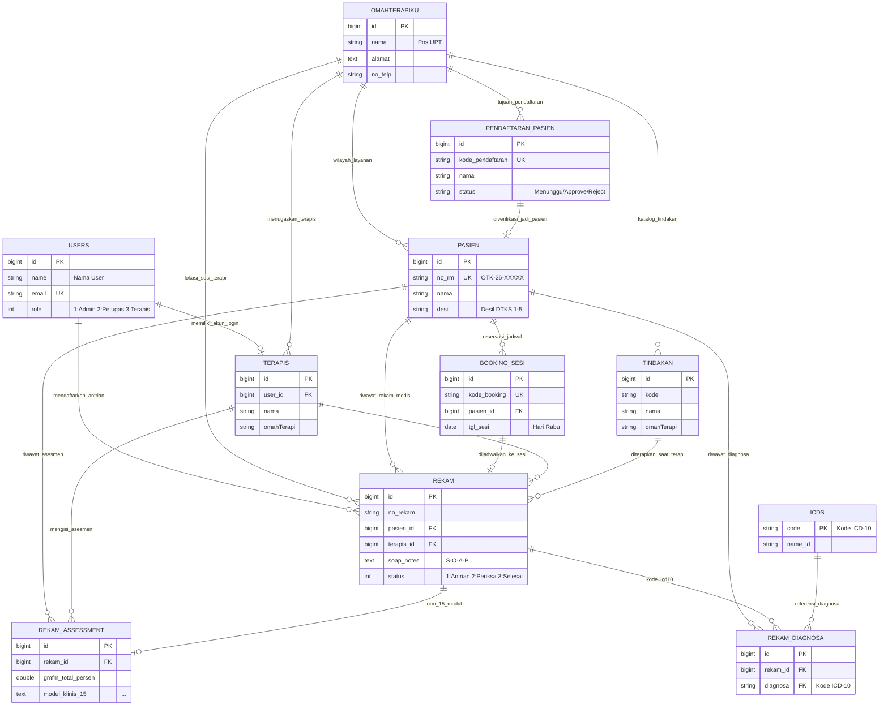

# Entity Relationship Diagram (ERD) — Omah Terapi-KU
**Dinas Sosial Provinsi Jawa Timur**  
*Ringkasan Garis Besar Struktur Basis Data*

---

## 1. Penjelasan Relasi Entitas Baru

Sebelum melihat diagram, berikut jawaban dan penjelasan hubungan untuk entitas **`PENDAFTARAN_PASIEN`** dan **`TINDAKAN`**:

1. **Relasi `PENDAFTARAN_PASIEN` (Pendaftaran Online):**
   - **Ke `PASIEN`:** Saat calon pasien mendaftar online mandiri melalui portal, datanya masuk ke `PENDAFTARAN_PASIEN`. Setelah petugas memverifikasi dan menyetujui (*Approve*), sistem secara otomatis menerbitkan Nomor Rekam Medis (`OTK-26-XXXXX`) dan menjadikannya data induk tetap di tabel **`PASIEN`** (`PENDAFTARAN_PASIEN ||--o| PASIEN : "diverifikasi_menjadi_data_pasien"`).
   - **Ke `OMAHTERAPIKU`:** Menunjukkan lokasi pos UPT tujuan pendaftaran awal penerima manfaat (`OMAHTERAPIKU ||--o{ PENDAFTARAN_PASIEN : "menerima_pengajuan_pendaftaran"`).

2. **Relasi `TINDAKAN` (Master Katalog Modalitas Terapi):**
   - **Ke `OMAHTERAPIKU`:** Master katalog tindakan fisioterapi, okupasi, wicara, dan sensori integrasi yang disediakan di masing-masing pos layanan UPT (`OMAHTERAPIKU ||--o{ TINDAKAN : "menyediakan_katalog_tindakan"`).
   - **Ke `REKAM`:** Pada saat sesi terapi berlangsung, terapis memilih dan mengintervensikan tindakan dari master `TINDAKAN` untuk dicatat dalam rekam medis pelayanan pasien (`TINDAKAN ||--o{ REKAM : "diterapkan_pada_sesi_terapi"`).

---

## 2. Diagram ERD Ringkas (Mermaid)

Berikut adalah diagram relasi entitas (*Entity Relationship Diagram*) dengan label relasi yang informatif dan deskriptif:

---

## 3. Ringkasan Entitas & Relasi Kunci

| No | Entitas (Tabel) | Deskripsi Garis Besar | Relasi Utama & Keterangan |
|---|---|---|---|
| 1 | **`users`** | Akun pengguna internal backoffice (Admin, Petugas, Terapis). | Memiliki akun login terapis dan mencatat antrian kunjungan di loket. |
| 2 | **`terapis`** | Profil tenaga kesehatan terapis dan pos penempatan. | Menangani sesi tindakan terapi pada `rekam` dan mengisi `rekam_assessment`. |
| 3 | **`omahterapiku`** | Master pos layanan / UPT Dinas Sosial Jawa Timur. | Menyelenggarakan sesi terapi, menaungi domisili pasien, menerima pendaftaran online, dan menyediakan katalog tindakan. |
| 4 | **`pasien`** | Data induk penerima manfaat disabilitas & desil DTKS 1–5. | Memiliki riwayat rekam medis, asesmen 15 modul, multi-diagnosa ICD-10, dan riwayat booking sesi. |
| 5 | **`pendaftaran_pasien`** | Data permohonan pendaftaran pasien baru mandiri via portal. | Diverifikasi & disetujui petugas loket untuk diterbitkan menjadi data induk `pasien` beserta No. RM. |
| 6 | **`booking_sesi`** | Reservasi jadwal terapi hari Rabu mandiri oleh wali pasien. | Diverifikasi petugas untuk dijadwalkan langsung ke antrian `rekam`. |
| 7 | **`rekam`** | Transaksi kunjungan sesi terapi, catatan SOAP, dan status antrian. | Menghubungkan pasien, terapis, pos UPT, form asesmen 15 modul, dan diagnosa ICD-10. |
| 8 | **`rekam_assessment`** | Lembar asesmen klinis komprehensif (15 modul: GMFM, Denver II, ROM/MMT, Body Chart, dll). | Melekat sebagai evaluasi mendalam pada transaksi kunjungan `rekam`. |
| 9 | **`rekam_diagnosa`** | Multi-diagnosa ICD-10 yang ditegakkan pada sesi terapi. | Menghubungkan rekam medis dengan master standar klasifikasi penyakit `icds`. |
| 10 | **`icds`** | Master referensi kode dan nama diagnosa internasional ICD-10. | Referensi standar penetapan diagnosa medis. |
| 11 | **`tindakan`** | Master katalog modalitas intervensi dan tindakan terapi. | Disediakan oleh pos `omahterapiku` dan diterapkan oleh terapis pada sesi `rekam`. |

---

## 4. Alur Bisnis Data Utama

1. **Pendaftaran & Validasi:**
   - Calon pasien mendaftar online $\rightarrow$ masuk ke `pendaftaran_pasien`.
   - Petugas memverifikasi desil DTKS 1–5 $\rightarrow$ disetujui (*Approve*) $\rightarrow$ otomatis dibuatkan No. RM (`OTK-26-XXXXX`) dan menjadi data induk di tabel `pasien`.
2. **Reservasi & Antrian Sesi:**
   - Wali pasien memesan sesi Rabu $\rightarrow$ masuk ke `booking_sesi`.
   - Petugas menyetujui jadwal $\rightarrow$ masuk ke antrian pelayanan di tabel `rekam` (status `1: Antrian`).
3. **Pelayanan Klinis Terpadu:**
   - Terapis memanggil pasien $\rightarrow$ status `2: Pemeriksaan`.
   - Terapis mengintervensikan modalitas dari katalog `tindakan` dan mencatat SOAP di tabel `rekam`.
   - Terapis menginput evaluasi 15 modul (skor GMFM-88, Denver II, ROM/MMT, Body Chart, dll) di `rekam_assessment`.
   - Terapis menetapkan kode diagnosa ICD-10 di `rekam_diagnosa` yang terhubung ke `icds`.
4. **Penyelesaian & Home Program:**
   - Sesi diselesaikan (status `4-5: Selesai`) $\rightarrow$ panduan Home Program langsung dapat dilihat dan diunduh wali melalui portal pasien.

---

> **Dokumen ERD Ringkas Omah Terapi-KU**  
> *Dinas Sosial Provinsi Jawa Timur*
