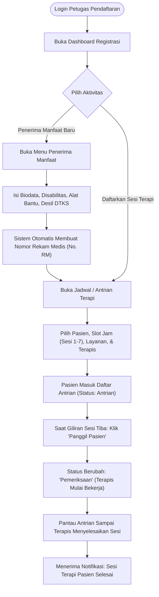
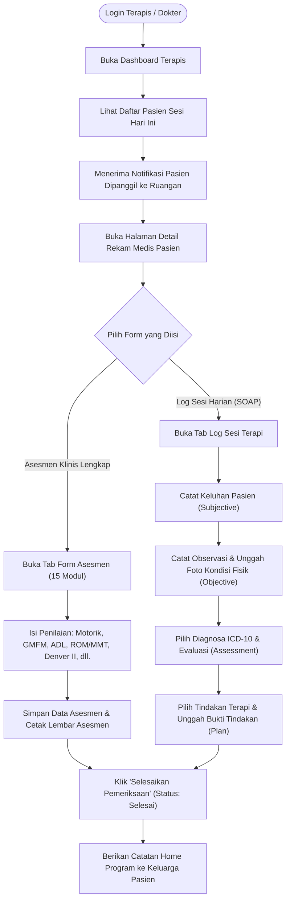
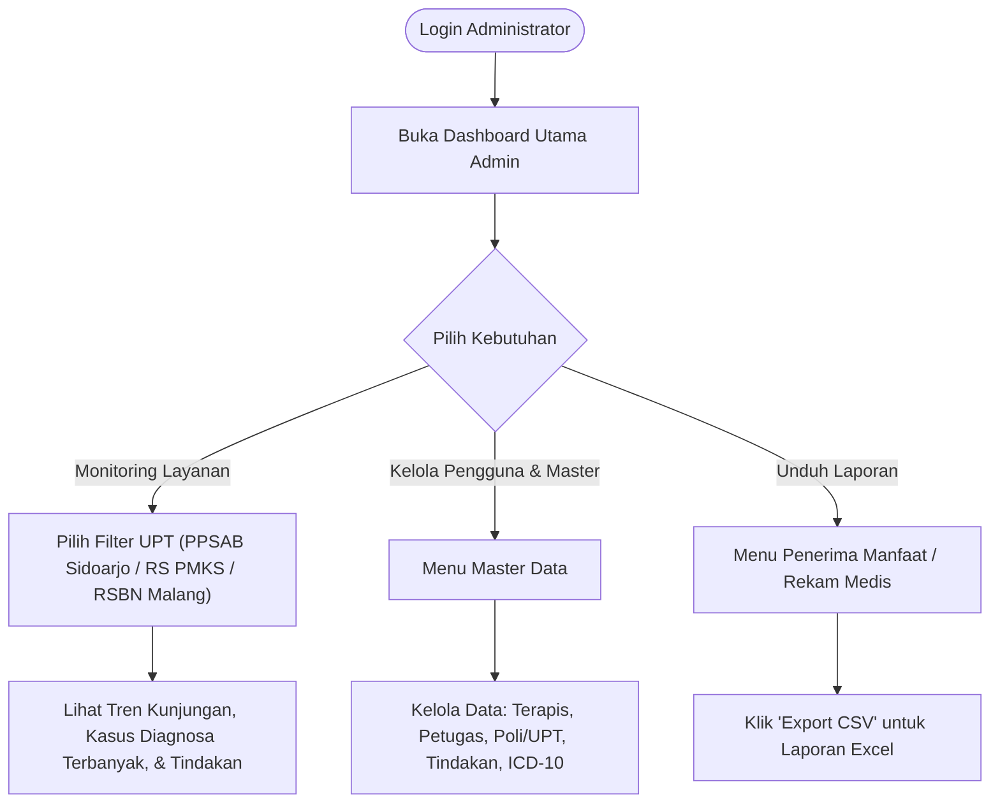
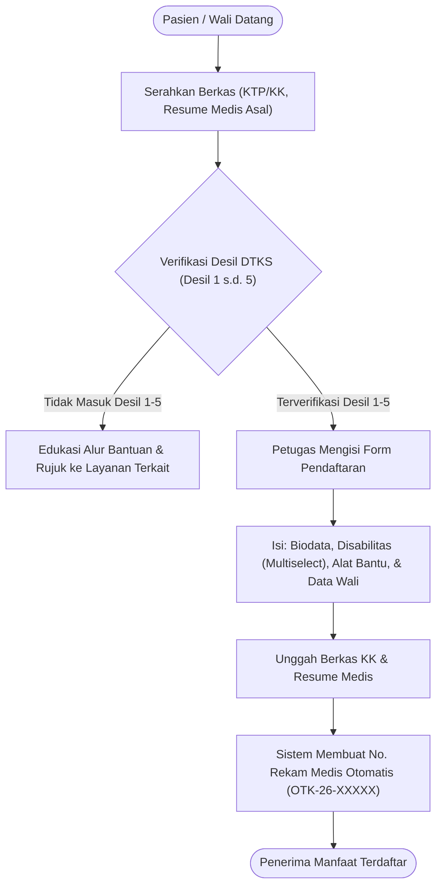
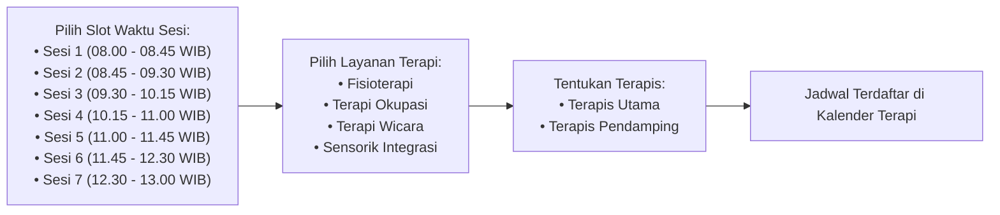
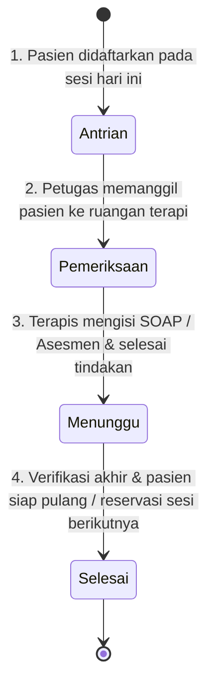
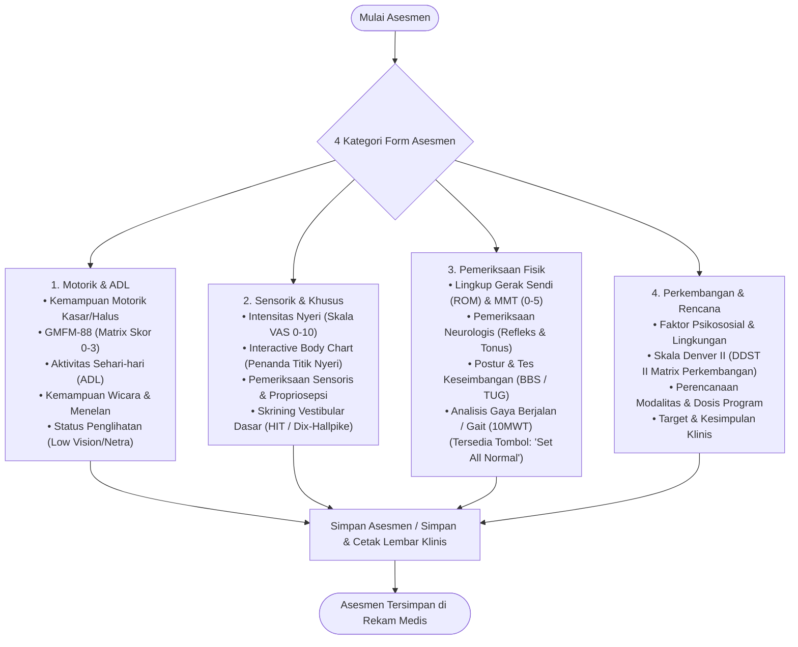

# Flowchart Alur Pelayanan & Penggunaan Aplikasi
**Omah Terapi-KU — Dinas Sosial Provinsi Jawa Timur**

Dokumen ini menjelaskan alur operasional dan proses kerja (*business flow*) aplikasi **Omah Terapi-KU** dari perspektif pengguna (Petugas Pendaftaran, Terapis/Dokter, dan Admin).

---

## 1. Alur Utama Pelayanan Klinis (End-to-End 5 Tahapan)

Berikut adalah gambaran besar alur pelayanan penerima manfaat mulai dari pendaftaran awal hingga terapi selesai:

```mermaid
flowchart TD
    START(["Mulai"]) --> T1["Tahap 1: Pendaftaran & Verifikasi"]
    
    subgraph TAHAP_1["1. Registrasi & Skrining Administrasi"]
        T1 --> DOKUMEN["Cek Dokumen (KTP/KK, Hasil Medis) & Desil DTKS 1-5"]
        DOKUMEN --> STATUS_PASIEN{"Penerima Manfaat Baru atau Lama?"}
        STATUS_PASIEN --"Baru"--> DAFTAR_BARU["Input Data Pasien & Buat No. Rekam Medis (No. RM)"]
        STATUS_PASIEN --"Lama"--> CARI_LAMA["Cari Pasien (via Nama / NIK / No. RM)"]
    end

    DAFTAR_BARU --> T2["Tahap 2: Penjadwalan & Pendaftaran Sesi"]
    CARI_LAMA --> T2

    subgraph TAHAP_2["2. Penjadwalan Sesi Terapi"]
        T2 --> PILIH_JADWAL["Pilih Tanggal Sesi (Hari Rabu) & Slot Waktu (30-45 Menit)"]
        PILIH_JADWAL --> PILIH_LAYANAN["Pilih Layanan (Fisioterapi / Okupasi / Wicara / Sensorik)"]
        PILIH_LAYANAN --> TENTUKAN_TERAPIS["Pilih Terapis Utama & Terapis Pendamping"]
        TENTUKAN_TERAPIS --> MASUK_ANTRIAN["Terbit Nomor Pendaftaran (Status: Antrian)"]
    end

    MASUK_ANTRIAN --> T3["Tahap 3: Pemanggilan Pasien"]

    subgraph TAHAP_3["3. Pemanggilan & Masuk Ruangan"]
        T3 --> PANGGIL["Petugas Memanggil Pasien Sesuai Urutan Sesi"]
        PANGGIL --> STATUS_PERIKSA["Status Berubah Menjadi: Pemeriksaan"]
        STATUS_PERIKSA --> NOTIF_DOKTER["Terapis Menerima Notifikasi Pasien Masuk"]
    end

    NOTIF_DOKTER --> T4["Tahap 4: Pelaksanaan Terapi & Asesmen"]

    subgraph TAHAP_4["4. Tindakan Klinis & Pencatatan"]
        T4 --> CEK_KUNJUNGAN{"Jenis Kunjungan?"}
        CEK_KUNJUNGAN --"Kunjungan Awal / Evaluasi Berkala"--> ASESMEN_LENGKAP["Isi Form Asesmen Klinis Lengkap (15 Bagian)"]
        CEK_KUNJUNGAN --"Sesi Rutin Lanjutan"--> SOAP_HARIAN["Catat Log SOAP Harian (S, O, A, P)"]
        ASESMEN_LENGKAP --> TINDAKAN["Lakukan Intervensi / Latihan Terapi"]
        SOAP_HARIAN --> TINDAKAN
        TINDAKAN --> CATAT_DIAGNOSA["Pilih Diagnosa & Rencana Terapi"]
    end

    CATAT_DIAGNOSA --> T5["Tahap 5: Evaluasi & Sesi Selesai"]

    subgraph TAHAP_5["5. Edukasi & Tindak Lanjut"]
        T5 --> EDUKASI["Berikan Saran Latihan di Rumah (Home Program) ke Wali"]
        EDUKASI --> UBAH_SELESAI["Terapis Mengubah Status Menjadi: Selesai"]
        UBAH_SELESAI --> SESI_LANJUT{"Perlu Jadwal Sesi Rabu Berikutnya?"}
        SESI_LANJUT --"Ya"--> PILIH_JADWAL
        SESI_LANJUT --"Tidak / Program Selesai"--> CETAK_RESUME["Cetak Hasil Asesmen / Resume (Opsional)"]
    end

    CETAK_RESUME --> SELESAI(["Selesai Pelayanan"])
```

---

## 2. Alur Pengguna Berdasarkan Peran (*User Journey by Role*)

### A. Alur Petugas Pendaftaran / Registrasi
Petugas pendaftaran bertugas mengelola penerimaan pasien, pendaftaran jadwal antrian, dan verifikasi administrasi.

---

### B. Alur Dokter / Terapis
Terapis bertanggung jawab melakukan asesmen, tindakan fisioterapi/okupasi/wicara/sensorik, serta pencatatan rekam medis.

---

### C. Alur Administrator
Administrator mengawasi operasional, mengelola master data, dan mencetak laporan analitik.

---

## 3. Detail Alur Proses Kunci

### A. Alur Pendaftaran Penerima Manfaat

---

### B. Alur Penjadwalan & Pembagian Slot Sesi
Sesi terapi dipusatkan pada hari **Rabu** pukul **08.00 - 13.00 WIB** dengan durasi 30-45 menit per penerima manfaat:

---

### C. Alur Transisi Status Pelayanan

---

### D. Alur Form Asesmen Klinis 15 Modul (Terapis)
Form asesmen klinis dikelompokkan ke dalam 4 kategori praktis:

---

> **Catatan Operasional:** Seluruh pelayanan di Omah Terapi-KU Dinas Sosial Provinsi Jawa Timur diberikan **secara gratis** tanpa pungutan biaya kepada penerima manfaat yang memenuhi kriteria.
