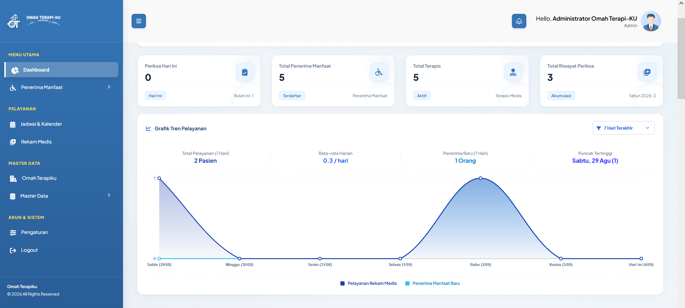

<p align="center">
  
</p>

<h1 align="center">Omah Terapi-KU</h1>

<p align="center">
  <strong>Sistem Informasi Pelayanan Terapi & Rekam Medis Penerima Manfaat</strong><br>
  Dinas Sosial Provinsi Jawa Timur
</p>

<p align="center">
  
  
  
  
  
</p>

<p align="center">
  
</p>

---

## Tentang Aplikasi

**Omah Terapi-KU** adalah platform digital manajemen pelayanan rehabilitasi terapi terpadu dan rekam medis klinis berbasis *evidence-based assessment* bagi Penerima Manfaat Disabilitas, Lansia, dan Anak Berkebutuhan Khusus (ABK) di lingkungan **Dinas Sosial Provinsi Jawa Timur**.

Sistem ini mendukung operasional multi-UPT dan multi-disiplin layanan terapi:
1. **Fisioterapi (Physiotherapy)**
2. **Terapi Okupasi & Sensori Integrasi (Occupational Therapy / SI)**
3. **Terapi Wicara & Menelan (Speech Therapy & Dysphagia)**
4. **Terapi Netra (Orientasi & Mobilitas / Braille)**

---

## Unit Pelaksana Teknis (UPT) Terintegrasi

| No | Unit Pelaksana Teknis (UPT) | Lokasi | Fokus Layanan Unggulan |
|:--:|:---|:---|:---|
| **1** | **UPT PPSAB Sidoarjo** | Sidoarjo | Anak Berkebutuhan Khusus (ABK), Cerebral Palsy, GDD, Autisme |
| **2** | **Balai PRS PMKS Sidoarjo** | Sidoarjo | Dewasa, Lansia, ODGJ, Rehabilitasi Pasca-Stroke |
| **3** | **UPT RSBN Malang** | Malang | Disabilitas Netra & Olahraga Adaptif |

---

## Fitur Utama

### 1. Manajemen Penerima Manfaat
* **Registrasi Terpadu:** Pencatatan NIK, No. Rekam Medis (format otomatis `OTK-YY-NNNNN`), data demografi, informasi wali, dan kategori disabilitas.
* **Klasifikasi Desil Kemiskinan:** Kategori Desil 1 hingga Desil 4 untuk prioritas layanan dan bantuan sosial.
* **Manajemen Berkas Digital:** Pengunggahan dokumen Kartu Keluarga (KK), KTP, surat rujukan, dan informed consent.
* **Ekspor Data:** Rekapitulasi data penerima manfaat ke dalam format CSV/Excel.

### 2. Modul Jadwal & Kalender Terapi
* **Manajemen Sesi Terapi:** Pengaturan 8 slot sesi kunjungan (08.00 s/d 14.30 WIB) khusus hari pelayanan reguler (Rabu).
* **Preset Navigasi Cepat:** Filter *Hari Ini*, *Rabu Terdekat*, dan pencarian nama terapis / penerima manfaat.
* **Kalender Visual:** Integrasi FullCalendar untuk visualisasi jadwal dan kapasitas kuota layanan harian.

### 3. Rekam Medis & Log Sesi SOAP
* **Profil Klinis & Capaian Fungsional:** Indikator live skor GMFM-88, evaluasi Skala Denver II, tingkat nyeri, dan rencana terapi aktif.
* **Catatan SOAP Terstandar:**
  * **S (Subjektif):** Anamnesis dan keluhan penerima manfaat / keluarga.
  * **O (Objektif):** Tanda-tanda vital, pemeriksaan fisik, dan dokumentasi foto.
  * **A (Assessment):** Evaluasi klinis terapis terintegrasi kode **ICD-10**.
  * **P (Plan):** Rencana tindakan terapi berdasarkan daftar master tindakan klinis.

### 4. Form Asesmen Klinis Komprehensif (15 Modul)
* **Pemeriksaan Fisik & Fungsional:** Kemampuan motorik kasar, skala GMFM-88, kemandirian ADL (Barthel Index), evaluasi wicara, status penglihatan, body chart & skala nyeri visual, ROM & MMT, neurologis & refleks, postur & Berg Balance Scale, analisis gaya berjalan (Gait 10MWT), sensoris & vestibular, serta faktor psikososial.
* **Skala Perkembangan Denver II:** 125 task perkembangan pada 4 sektor (Personal Sosial, Motorik Halus, Bahasa, Motorik Kasar) dengan kesimpulan otomatis.
* **Cetak & Ekspor PDF:** Lembar cetak resmi monokrom standar kedinasan dengan Kop Surat resmi Pemerintah Provinsi Jawa Timur dan fitur anti-potong halaman (*page-break protection*).

### 5. Master Data Terintegrasi
* **Master Unit Omah Terapi-KU:** Pengelolaan profil UPT, alamat, fokus layanan, dan penugasan terapis.
* **Master Tindakan:** Katalog tindakan Fisioterapi (`FIS`), Terapi Okupasi (`OKU`), Terapi Wicara (`WIC`), dan Terapi Netra (`NET`).
* **Master Diagnosa ICD-10:** Kode klasifikasi penyakit dan kondisi disabilitas.
* **Master Petugas & Terapis:** Pengelolaan hak akses, NIP, kontak, dan keamanan akun.

---

## Hak Akses Pengguna

| Role | Identitas | Cakupan Akses |
|:---|:---:|:---|
| **Super Admin** | Role 1 | Akses penuh sistem, pengelolaan master data, rekam medis, asesmen, dan konfigurasi aplikasi. |
| **Petugas Registrasi** | Role 2 | Registrasi penerima manfaat baru, verifikasi berkas/desil, dan pengelolaan antrian pelayanan. |
| **Terapis / Dokter** | Role 3 | Pengisian form asesmen 15 modul, pencatatan log SOAP harian, dan evaluasi hasil terapi. |

---

## Panduan Instalasi

### 1. Clone Repository & Install Dependencies
```bash
git clone https://github.com/dika-maulidal/omah-terapiku.git
cd omah-terapiku

composer install
cp .env.example .env
```

### 2. Konfigurasi Database `.env`
Sesuaikan kredensial database pada file `.env`:
```env
DB_CONNECTION=mysql
DB_HOST=127.0.0.1
DB_PORT=3306
DB_DATABASE=omah_terapiku
DB_USERNAME=root
DB_PASSWORD=
```

### 3. Migrasi & Seeding Data
```bash
php artisan key:generate
php artisan migrate --seed
php artisan storage:link
php artisan optimize:clear
```

### 4. Menjalankan Server Lokal
```bash
php artisan serve
```
Akses aplikasi melalui peramban: `http://localhost:8000`

---

## Akun Login Default

Akun bawaan yang otomatis dibuat melalui database seeder dengan password default: `password`

| No | Role | Nama Akun | Unit Penugasan | Email Login | NIP | Password |
|:--:|:---|:---|:---|:---|:---:|:---:|
| **1** | Super Admin | Administrator Omah Terapi-KU | Dinas Sosial Prov. Jatim | `admin@rekammedis.local` | `199001012026011001` | `password` |
| **2** | Petugas Registrasi | Petugas Registrasi & Asesmen | Loket Pendaftaran Terpadu | `registrasi@rekammedis.local` | `199101012026011002` | `password` |
| **3** | Terapis | Budi Hartanto, S.Tr.Kes | UPT PPSAB Sidoarjo | `terapis.ppsab@rekammedis.local` | `199201012026011003` | `password` |
| **4** | Terapis | Siti Rahmawati, A.Md.OT | Balai PRS PMKS Sidoarjo | `terapis.pmks@rekammedis.local` | `199301012026011004` | `password` |
| **5** | Terapis | Dadar Putra, S.Pd | UPT RSBN Malang | `terapis.rsbn@rekammedis.local` | `199401012026011005` | `password` |

---

## Lisensi
Dikembangkan untuk **Dinas Sosial Provinsi Jawa Timur** dalam rangka digitalisasi pelayanan rehabilitasi sosial dan terapi terpadu bagi masyarakat.