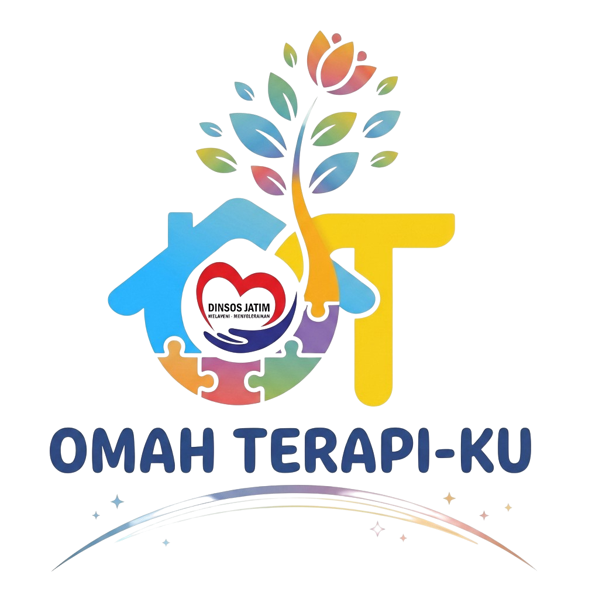

<p align="center">
  
</p>

<h1 align="center">Omah Terapiku</h1>

<p align="center">
  <strong>Sistem Informasi Pelayanan Terapi & Rekam Medis Penerima Manfaat</strong><br>
  Dinas Sosial Provinsi Jawa Timur
</p>

<p align="center">
  
  
  
  
</p>

---

## Tentang Aplikasi

Omah Terapiku adalah sistem informasi rekam medis dan manajemen pelayanan terapi bagi penerima manfaat di bawah naungan **Dinas Sosial Provinsi Jawa Timur**. Sistem ini mengelola alur pendaftaran, antrian pemeriksaan, rekam medis SOAP, diagnosa ICD-10, tindakan terapis, dan pelaporan statistik.

---

## Fitur Utama

- **Dashboard**: Statistik kunjungan harian, grafik bulanan penerima manfaat dengan filter tahun, pie chart status antrian, dan top diagnosa ICD-10.
- **Penerima Manfaat**: Pendaftaran pasien, pencatatan kontak wali, jenis disabilitas, nomor BPJS, dan riwayat rekam medis.
- **Rekam Medis (SOAP)**: Pencatatan keluhan (S), pemeriksaan fisik dan foto (O), diagnosa ICD-10 (A), serta rencana tindakan terapi (P).
- **Master Data**: Manajemen Omah Terapiku, Data Terapis/Dokter, Petugas Loket, dan Kode ICD-10.
- **Export Laporan**: Ekspor data penerima manfaat dan rekam medis ke CSV.

---

## Hak Akses (Roles)

| Role | Hak Akses |
|:---|:---|
| **Admin** | Kontrol penuh terhadap seluruh modul sistem, master data, rekam medis, dan pengguna. |
| **Pendaftaran** | Mengelola pendaftaran penerima manfaat baru dan antrian registrasi harian. |
| **Dokter / Terapis** | Memproses antrian pasien, input rekam medis SOAP, dan menyelesaikan tindakan terapi. |

---

## Panduan Instalasi

```bash
# 1. Clone repository
git clone https://github.com/username/omah-terapiku.git
cd omah-terapiku

# 2. Install dependensi
composer install

# 3. Konfigurasi environment
cp .env.example .env

# 4. Setup aplikasi & database
php artisan key:generate
php artisan migrate --seed
php artisan storage:link

# 5. Jalankan server lokal
php artisan serve
```

---

## Akun Login Default

| Role | Email / Username | Password |
|:---|:---|:---|
| Admin | `admin@rekammedis.local` | `password` |
| Pendaftaran | `registrasi@rekammedis.local` | `password` |
| Dokter / Terapis | `dokter@rekammedis.local` | `password` |