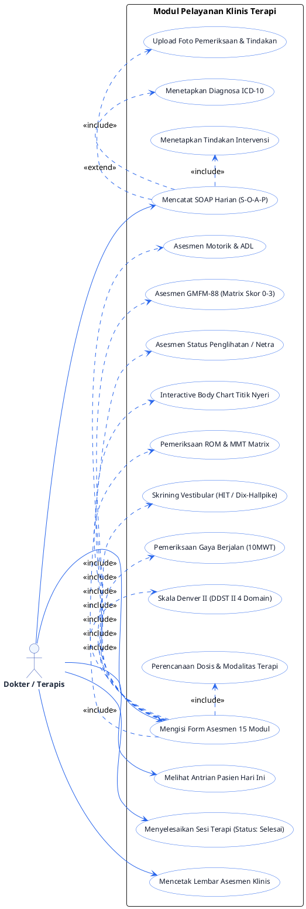

# Dokumen Use Case Diagram — Omah Terapi-KU
**Dinas Sosial Provinsi Jawa Timur**
*Sistem Informasi Rekam Medis & Manajemen Pelayanan Terapi Inklusif*

---

## 1. Diagram Use Case Utama (Global System Use Case)

Berikut adalah diagram Use Case lengkap sistem **Omah Terapi-KU** menggunakan sintaks PlantUML:

```plantuml
@startuml
left to right direction
skinparam packageStyle rectangle
skinparam roundcorner 8
skinparam shadowing false
skinparam handwritten false

skinparam actor {
    BackgroundColor #eff6ff
    BorderColor #1e40af
    FontColor #1e293b
    FontSize 13
    FontStyle bold
}

skinparam usecase {
    BackgroundColor #ffffff
    BorderColor #2563eb
    FontColor #0f172a
    FontSize 12
    ArrowColor #2563eb
}

skinparam package {
    BackgroundColor #f8fafc
    BorderColor #94a3b8
    FontColor #1e40af
    FontStyle bold
}

' ==========================================
' AKTOR SISTEM
' ==========================================
actor "Petugas Pendaftaran" as Petugas
actor "Dokter / Terapis" as Terapis
actor "Administrator" as Admin

' ==========================================
' BOUNDARY SISTEM OMAH TERAPI-KU
' ==========================================
rectangle "Sistem Informasi Omah Terapi-KU" {

    ' --- Paket Autentikasi & Akun ---
    package "Autentikasi & Profil" {
        usecase "UC-01: Login ke Sistem" as UC_Login
        usecase "UC-02: Logout dari Sistem" as UC_Logout
        usecase "UC-03: Kelola Profil & Ganti Password" as UC_Profile
        usecase "UC-04: Filter Global UPT Lokasi" as UC_FilterUPT
    }

    ' --- Paket Penerima Manfaat ---
    package "Pengelolaan Penerima Manfaat" {
        usecase "UC-05: Pendaftaran Penerima Manfaat Baru" as UC_RegPM
        usecase "UC-06: Verifikasi Desil DTKS 1-5 & Dokumen" as UC_VerifDTKS
        usecase "UC-07: Generate No. Rekam Medis Otomatis" as UC_GenRM
        usecase "UC-08: Pencarian & Kelola Data Pasien" as UC_CariPM
        usecase "UC-09: Unggah Berkas KK & Resume Medis" as UC_UploadBerkas
    }

    ' --- Paket Jadwal & Antrian ---
    package "Penjadwalan & Antrian Terapi" {
        usecase "UC-10: Booking Sesi Terapi (Hari Rabu)" as UC_Booking
        usecase "UC-11: Pemilihan Slot Waktu (Sesi 1-7)" as UC_SlotWaktu
        usecase "UC-12: Penunjukan Multi-Terapis" as UC_MultiTerapis
        usecase "UC-13: Pemanggilan Antrian Pasien" as UC_Panggil
        usecase "UC-14: Monitoring Kalender Jadwal Terapi" as UC_Kalender
    }

    ' --- Paket Pelayanan Klinis ---
    package "Pelayanan Klinis & Rekam Medis" {
        usecase "UC-15: Pencatatan Log Sesi Harian (SOAP)" as UC_SOAP
        usecase "UC-16: Pengisian Asesmen Klinis 15 Modul" as UC_Asesmen
        usecase "UC-17: Penilaian GMFM-88 (Auto-Calculation)" as UC_GMFM
        usecase "UC-18: Penilaian Skala Denver II (DDST II)" as UC_Denver
        usecase "UC-19: Penandaan Interactive Body Chart" as UC_BodyChart
        usecase "UC-20: Pemeriksaan ROM & MMT Matrix" as UC_ROM_MMT
        usecase "UC-21: Input Diagnosa ICD-10 & Tindakan" as UC_DiagnosaTindakan
        usecase "UC-22: Edukasi Home Exercise Program" as UC_HomeProgram
        usecase "UC-23: Cetak Lembar Asesmen & Resume" as UC_Cetak
    }

    ' --- Paket Master Data & Analitik ---
    package "Master Data & Laporan" {
        usecase "UC-24: Monitoring Dashboard Analitik" as UC_Dash
        usecase "UC-25: Kelola Master Dokter & Terapis" as UC_MDokter
        usecase "UC-26: Kelola Master Petugas & Admin" as UC_MPetugas
        usecase "UC-27: Kelola Master UPT / Poli" as UC_MPoli
        usecase "UC-28: Kelola Master Tindakan Terapi" as UC_MTindakan
        usecase "UC-29: Kelola Master Diagnosa ICD-10" as UC_MICD
        usecase "UC-30: Ekspor Laporan Rekam Medis (CSV)" as UC_Export
    }
}

' ==========================================
' RELASI AKTOR DENGAN USE CASE
' ==========================================

' Relasi Petugas Pendaftaran
Petugas --> UC_Login
Petugas --> UC_Logout
Petugas --> UC_Profile
Petugas --> UC_FilterUPT
Petugas --> UC_RegPM
Petugas --> UC_CariPM
Petugas --> UC_Booking
Petugas --> UC_Panggil
Petugas --> UC_Kalender

' Relasi Dokter / Terapis
Terapis --> UC_Login
Terapis --> UC_Logout
Terapis --> UC_Profile
Terapis --> UC_FilterUPT
Terapis --> UC_SOAP
Terapis --> UC_Asesmen
Terapis --> UC_DiagnosaTindakan
Terapis --> UC_HomeProgram
Terapis --> UC_Cetak
Terapis --> UC_Kalender

' Relasi Admin
Admin --> UC_Login
Admin --> UC_Logout
Admin --> UC_Profile
Admin --> UC_FilterUPT
Admin --> UC_Dash
Admin --> UC_MDokter
Admin --> UC_MPetugas
Admin --> UC_MPoli
Admin --> UC_MTindakan
Admin --> UC_MICD
Admin --> UC_Export
Admin --> UC_RegPM
Admin --> UC_SOAP
Admin --> UC_Asesmen

' ==========================================
' RELASI INCLUDE & EXTEND
' ==========================================
UC_RegPM .> UC_VerifDTKS : <<include>>
UC_RegPM .> UC_GenRM : <<include>>
UC_RegPM .> UC_UploadBerkas : <<extend>>

UC_Booking .> UC_SlotWaktu : <<include>>
UC_Booking .> UC_MultiTerapis : <<extend>>

UC_Asesmen .> UC_GMFM : <<include>>
UC_Asesmen .> UC_Denver : <<include>>
UC_Asesmen .> UC_BodyChart : <<include>>
UC_Asesmen .> UC_ROM_MMT : <<include>>

UC_Asesmen .> UC_Cetak : <<extend>>
UC_SOAP .> UC_DiagnosaTindakan : <<include>>

@enduml
```

---

## 2. Diagram Rinci Subsistem Pelayanan Klinis & Asesmen Terapis

Diagram ini memfokuskan alur interaksi **Dokter / Terapis** dalam melakukan tindakan rekam medis, asesmen 15 modul klinis, dan evaluasi terapi:

---

## 3. Identifikasi & Spesifikasi Aktor

| No | Nama Aktor | Deskripsi Peran & Tanggung Jawab |
|---|---|---|
| 1 | **Petugas Pendaftaran** *(Role 2)* | Menerima berkas calon penerima manfaat, memverifikasi kriteria Desil DTKS 1–5, mendaftarkan identitas pasien baru, menjadwalkan sesi terapi (slot hari Rabu), memanggil antrian pasien, serta memantau status antrian pelayanan. |
| 2 | **Dokter / Terapis** *(Role 3)* | Mengakses rekam medis pasien di ruang terapi, melakukan asesmen baseline/re-evaluasi (15 bagian klinis), mencatat log harian SOAP (*Subjective, Objective, Assessment, Plan*), memilih diagnosa ICD-10, merancang program latihan mandiri (*Home Program*), dan mencetak hasil asesmen. |
| 3 | **Administrator** *(Role 1)* | Mengawasi seluruh jalannya operasional lintas UPT, mengelola hak akses akun pengguna (petugas & dokter), mengelola master data (tindakan, poli/UPT, ICD-10), memantau visualisasi grafik analitik, dan mengekspor laporan rekam medis ke CSV. |

---

## 4. Matriks Hak Akses Use Case (*Access Control Matrix*)

| ID Use Case | Nama Use Case | Petugas Pendaftaran | Dokter / Terapis | Administrator |
|---|---|:---:|:---:|:---:|
| **UC-01** | Login ke Sistem | ✅ | ✅ | ✅ |
| **UC-02** | Logout dari Sistem | ✅ | ✅ | ✅ |
| **UC-03** | Kelola Profil & Password | ✅ | ✅ | ✅ |
| **UC-04** | Filter Global Scope UPT | ✅ | ✅ | ✅ |
| **UC-05** | Pendaftaran Penerima Manfaat Baru | ✅ | ❌ | ✅ |
| **UC-06** | Verifikasi Desil DTKS & Dokumen | ✅ | ❌ | ✅ |
| **UC-07** | Generate No. RM Otomatis | ✅ | ❌ | ✅ |
| **UC-08** | Pencarian & Kelola Data Pasien | ✅ | ✅ *(Read)* | ✅ |
| **UC-09** | Unggah Berkas KK & Resume Medis | ✅ | ❌ | ✅ |
| **UC-10** | Booking Sesi Terapi Rabu | ✅ | ❌ | ✅ |
| **UC-11** | Pemilihan Slot Waktu (Sesi 1–7) | ✅ | ❌ | ✅ |
| **UC-12** | Penunjukan Multi-Terapis | ✅ | ❌ | ✅ |
| **UC-13** | Pemanggilan Antrian Pasien | ✅ | ❌ | ✅ |
| **UC-14** | Monitoring Kalender Jadwal | ✅ | ✅ *(Jadwal Sendiri)* | ✅ |
| **UC-15** | Pencatatan Log Harian SOAP | ❌ | ✅ | ✅ |
| **UC-16** | Pengisian Form Asesmen 15 Modul | ❌ | ✅ | ✅ |
| **UC-17** | Penilaian GMFM-88 Auto-Calc | ❌ | ✅ | ✅ |
| **UC-18** | Penilaian Denver II (DDST II) | ❌ | ✅ | ✅ |
| **UC-19** | Penandaan Interactive Body Chart | ❌ | ✅ | ✅ |
| **UC-20** | Pemeriksaan ROM & MMT Matrix | ❌ | ✅ | ✅ |
| **UC-21** | Input Diagnosa ICD-10 & Tindakan | ❌ | ✅ | ✅ |
| **UC-22** | Edukasi Home Exercise Program | ❌ | ✅ | ✅ |
| **UC-23** | Cetak Lembar Asesmen & Resume | ❌ | ✅ | ✅ |
| **UC-24** | Monitoring Dashboard Analitik | ❌ | ❌ | ✅ |
| **UC-25** | Kelola Master Dokter & Terapis | ❌ | ❌ | ✅ |
| **UC-26** | Kelola Master Petugas & Admin | ❌ | ❌ | ✅ |
| **UC-27** | Kelola Master UPT / Poli | ❌ | ❌ | ✅ |
| **UC-28** | Kelola Master Tindakan Terapi | ❌ | ❌ | ✅ |
| **UC-29** | Kelola Master Diagnosa ICD-10 | ❌ | ❌ | ✅ |
| **UC-30** | Ekspor Laporan Rekam Medis CSV | ❌ | ❌ | ✅ |

---

## 5. Ringkasan Hubungan Use Case (Include & Extend)

1. **`UC-05 (Pendaftaran Penerima Manfaat Baru)`**:
   - Mengharuskan `<<include>>` **UC-06 (Verifikasi Desil DTKS 1-5)** sebagai syarat kelayakan penerima manfaat gratis.
   - Mengharuskan `<<include>>` **UC-07 (Generate No. RM Otomatis)** dengan format `OTK-26-XXXXX`.
   - Mengembangkan `<<extend>>` **UC-09 (Unggah Berkas KK & Resume Medis)** jika penerima manfaat membawa berkas fisik.

2. **`UC-10 (Booking Sesi Terapi)`**:
   - Mengharuskan `<<include>>` **UC-11 (Pemilihan Slot Waktu)** untuk membagi sesi operasional hari Rabu ke dalam slot 30–45 menit.
   - Mengembangkan `<<extend>>` **UC-12 (Penunjukan Multi-Terapis)** jika sesi terapi membutuhkan terapis pendamping.

3. **`UC-16 (Pengisian Asesmen Klinis 15 Modul)`**:
   - Mengharuskan `<<include>>` modul-modul inti seperti **UC-17 (GMFM-88)**, **UC-18 (Denver II)**, **UC-19 (Interactive Body Chart)**, dan **UC-20 (ROM & MMT Matrix)**.
   - Mengembangkan `<<extend>>` **UC-23 (Cetak Lembar Asesmen)** jika terapis ingin langsung mencetak dokumen hasil asesmen.

---

> **Dokumen ini disusun sebagai acuan fungsional Use Case aplikasi Omah Terapi-KU Dinas Sosial Provinsi Jawa Timur.**
