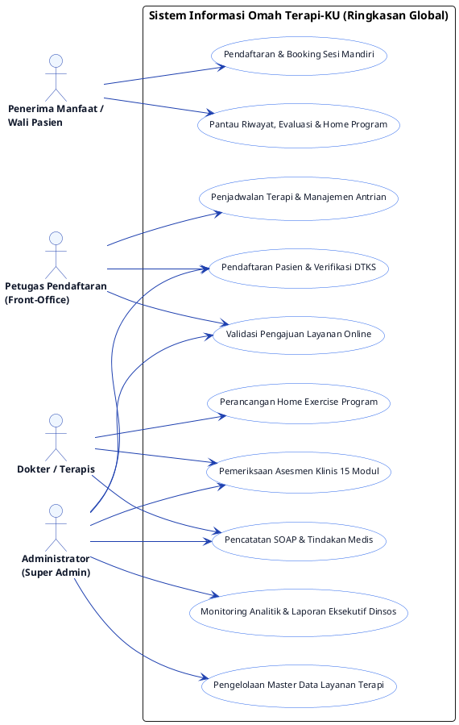
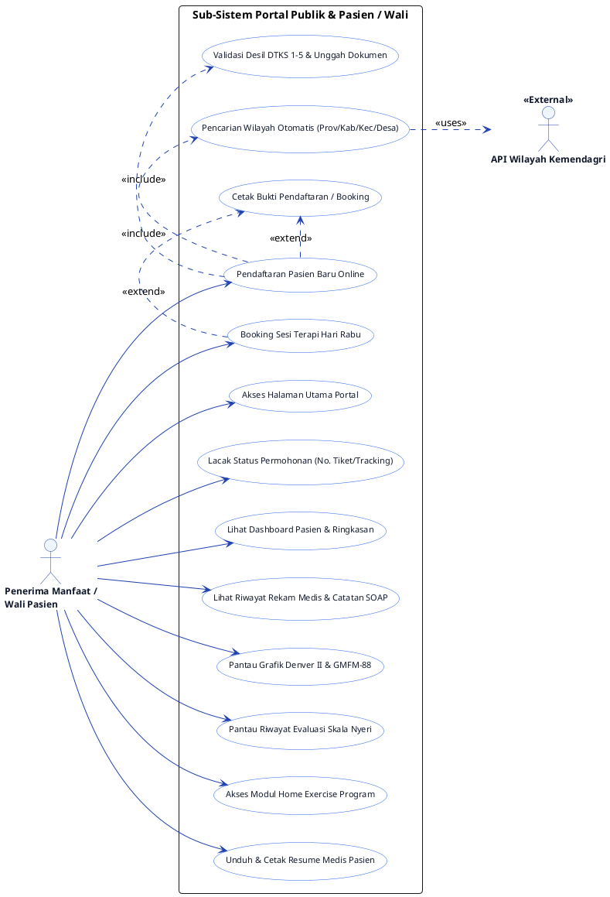
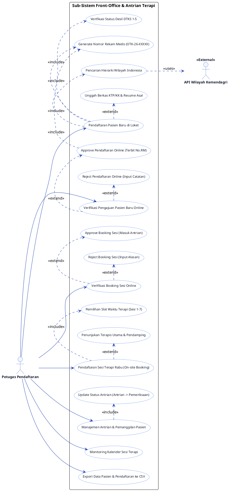
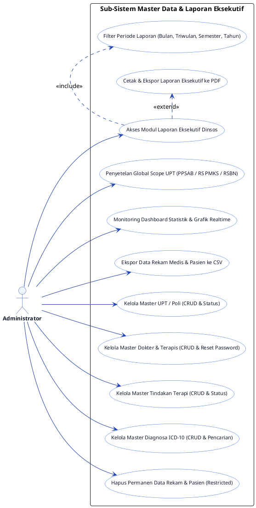

# Dokumen Spesifikasi & Use Case Diagram — Omah Terapi-KU
**Dinas Sosial Provinsi Jawa Timur**  
*Sistem Informasi Rekam Medis, Pelayanan Terapi Inklusif & Portal Pasien*

---

## Daftar Isi
1. [Pendahuluan & Konteks Sistem](#1-pendahuluan--konteks-sistem)
2. [Identifikasi & Deskripsi Aktor](#2-identifikasi--deskripsi-aktor)
3. [Diagram Use Case Utama (Global System Overview)](#3-diagram-use-case-utama-global-system-overview)
4. [Diagram Use Case Sub-Sistem Rinci](#4-diagram-use-case-sub-sistem-rinci)
   - 4.1 [Sub-Sistem Portal Publik & Wali Pasien (Penerima Manfaat)](#41-sub-sistem-portal-publik--wali-pasien)
   - 4.2 [Sub-Sistem Pelayanan Klinis, Asesmen & Rekam Medis (Dokter/Terapis)](#42-sub-sistem-pelayanan-klinis-asesmen--rekam-medis)
   - 4.3 [Sub-Sistem Front-Office, Registrasi & Antrian (Petugas Pendaftaran)](#43-sub-sistem-front-office-registrasi--antrian)
   - 4.4 [Sub-Sistem Manajemen Master Data, Eksekutif & Laporan (Administrator)](#44-sub-sistem-manajemen-master-data-eksekutif--laporan)
5. [Matriks Hak Akses Use Case (Access Control Matrix)](#5-matriks-hak-akses-use-case-access-control-matrix)
6. [Kamus & Spesifikasi Rinci Use Case (Use Case Narrative)](#6-kamus--spesifikasi-rinci-use-case-use-case-narrative)
7. [Panduan Visualisasi & Render PlantUML](#7-panduan-visualisasi--render-plantuml)

---

## 1. Pendahuluan & Konteks Sistem

Aplikasi **Omah Terapi-KU** adalah platform pelayanan terapi dan manajemen rekam medis digital inklusif yang diselenggarakan oleh **Dinas Sosial Provinsi Jawa Timur** untuk melayani anak-anak berkebutuhan khusus dan penyandang disabilitas (Penerima Manfaat) dari keluarga rentan/miskin (kriteria Desil DTKS 1–5) secara **gratis**.

Sistem ini mencakup alur layanan terpadu:
1. **Portal Mandiri Pasien/Wali:** Pendaftaran pasien baru secara online, booking sesi terapi mandiri (hari Rabu), pelacakan status permohonan dengan kode tiket, pemantauan grafik perkembangan klinis (Denver II, GMFM-88, Evaluasi Nyeri), serta akses panduan materi Home Exercise Program.
2. **Front-Office & Antrian:** Verifikasi berkas fisik & kriteria desil DTKS 1–5, pembuatan otomatis Nomor Rekam Medis (`OTK-26-XXXXX`), pengelolaan jadwal sesi operasional hari Rabu (Sesi 1–7), penugasan multi-terapis (utama & pendamping), pemanggilan antrian, serta validasi persetujuan pendaftaran dan booking online.
3. **Klinis & Rekam Medis (Dokter/Terapis):** Pengisian formulir asesmen klinis komprehensif (15 modul klinis termasuk kalkulasi otomatis GMFM-88, Skala Denver II / DDST II, Interactive Body Chart penanda titik nyeri, ROM & MMT Matrix), pencatatan log harian SOAP (*Subjective, Objective, Assessment, Plan*), diagnosa ICD-10, tindakan terapi, perancangan Home Exercise Program, serta pencetakan dokumen klinis.
4. **Eksekutif & Master Data Layanan (Admin):** Filter analitik lingkup UPT (PPSAB Sidoarjo, RS PMKS, RSBN Malang), penyusunan Laporan Eksekutif & Statistik Dinas Sosial terstandarisasi (Bulanan, Triwulan, Semester, Tahunan), ekspor data CSV/PDF, dan pengelolaan master data fasilitas, tenaga terapis, tindakan modalitas, serta kode diagnosa ICD-10.

---

## 2. Identifikasi & Deskripsi Aktor

Sistem Omah Terapi-KU melibatkan 4 aktor pengguna (*Human Actors*) dan 1 sistem eksternal pendukung (*External System Actor*):

| No | Nama Aktor | Tipe | Peran & Tanggung Jawab Utama |
|---|---|---|---|
| 1 | **Penerima Manfaat / Wali Pasien** | *Human (Public/Client)* | Mengakses portal publik, melakukan pendaftaran pasien baru mandiri, reservasi booking sesi terapi hari Rabu, memantau grafik riwayat perkembangan evaluasi (Denver II, GMFM, Nyeri), mengakses materi latihan mandiri (*Home Program*), melacak status pengajuan, serta mencetak bukti pendaftaran. |
| 2 | **Petugas Pendaftaran** *(Front-Office)* | *Human (Staff)* | Menerima & memverifikasi dokumen fisik/online calon penerima manfaat (Desil DTKS 1–5), menginput identitas pasien baru di loket, menyetujui/menolak pengajuan pendaftaran dan booking online, menjadwalkan sesi terapi hari Rabu (slot 1–7), menugaskan terapis, dan memanggil antrian pasien. |
| 3 | **Dokter / Terapis** | *Human (Clinical Staff)* | Melakukan pemeriksaan fisik dan evaluasi komprehensif (15 modul klinis), mencatat log harian SOAP, menetapkan diagnosa ICD-10 dan tindakan intervensi, merancang materi Home Program untuk orang tua/wali, serta mencetak lembar asesmen dan resume medis. |
| 4 | **Administrator** | *Human (Super Admin)* | Mengawasi seluruh operasional pelayanan lintas UPT, mengelola master data layanan (UPT/Pos Layanan, Dokter/Terapis, Tindakan, ICD-10), memantau grafik analitik realtime, menyusun dan mencetak Laporan Eksekutif Statistik Dinsos (PDF), dan mengunduh rekap CSV. |
| 5 | **API Wilayah Kemendagri** | *External System* | Layanan eksternal penyedia data hierarki wilayah Indonesia (Provinsi, Kabupaten/Kota, Kecamatan, Desa/Kelurahan) yang digunakan untuk integrasi pengisian alamat otomatis secara valid. |

---

## 3. Diagram Use Case Utama (Global System Overview)

Diagram berikut menyajikan gambaran makro (*High-Level System Overview*) fungsi utama sistem **Omah Terapi-KU** tanpa memadati diagram dengan detail teknis berlebih. Rincian setiap modul tersedia pada [Bab 4 (Diagram Sub-Sistem Rinci)](#4-diagram-use-case-sub-sistem-rinci).



---

## 4. Diagram Use Case Sub-Sistem Rinci

Berikut adalah perincian use case pada masing-masing sub-sistem utama sesuai alur kerja aplikasi:

### 4.1 Sub-Sistem Portal Publik & Wali Pasien

Diagram ini menggambarkan fungsionalitas mandiri yang dapat diakses oleh masyarakat umum dan orang tua/wali penerima manfaat melalui portal publik:



---

### 4.2 Sub-Sistem Pelayanan Klinis, Asesmen & Rekam Medis

Diagram ini memetakan aktivitas **Dokter / Terapis** dalam melakukan rekam medis, asesmen komprehensif 15 modul, penginputan SOAP harian, dan penyusunan rencana terapi:

```plantuml
@startuml
left to right direction
skinparam packageStyle rectangle
skinparam roundcorner 8
skinparam shadowing false
skinparam defaultFontName "Segoe UI", Arial, sans-serif

skinparam actor {
    BackgroundColor #eff6ff
    BorderColor #1e40af
    FontColor #0f172a
    FontSize 12
    FontStyle bold
}

skinparam usecase {
    BackgroundColor #ffffff
    BorderColor #2563eb
    FontColor #0f172a
    FontSize 11
    ArrowColor #1e40af
}

actor "Dokter / Terapis" as Terapis

rectangle "Sub-Sistem Pelayanan Klinis & Rekam Medis" {
    usecase "Melihat Antrian & Riwayat Rekam Pasien" as UC_ListAntrian
    
    ' --- SOAP Module ---
    usecase "Pencatatan SOAP Harian (S-O-A-P)" as UC_SOAP_Main
    usecase "Input Anamnesa Keluhan (Subjective)" as UC_S
    usecase "Input Pemeriksaan Fisik & Tanda Vital (Objective)" as UC_O
    usecase "Upload Foto Pemeriksaan & Tindakan" as UC_Foto
    usecase "Pilih Diagnosa ICD-10 (Assessment)" as UC_A
    usecase "Pilih Tindakan & Rencana Terapi (Plan)" as UC_P
    
    ' --- 15 Clinical Modules Assessment ---
    usecase "Pengisian Asesmen Klinis 15 Modul" as UC_Asesmen_Main
    usecase "Modul 1: Kemampuan Motorik Kasar & Halus" as UC_M1
    usecase "Modul 2: GMFM-88 (Matrix Skor 0-3 Auto-Calc)" as UC_M2
    usecase "Modul 3: Aktivitas Kehidupan Sehari-hari (ADL)" as UC_M3
    usecase "Modul 4: Skala Denver II (DDST II 4 Domain)" as UC_M4
    usecase "Modul 5: Interactive Body Chart Penanda Nyeri" as UC_M5
    usecase "Modul 6: Skala Intensitas Nyeri (VAS 0-10)" as UC_M6
    usecase "Modul 7: Pemeriksaan ROM & MMT Matrix (0-5)" as UC_M7
    usecase "Modul 8: Skrining Vestibular (HIT / Dix-Hallpike)" as UC_M8
    usecase "Modul 9: Analisis Gaya Berjalan / Gait (10MWT)" as UC_M9
    usecase "Modul 10: Status Penglihatan / Low Vision" as UC_M10
    usecase "Modul 11: Kemampuan Wicara & Menelan" as UC_M11
    usecase "Modul 12: Pemeriksaan Sensoris & Propriosepsi" as UC_M12
    usecase "Modul 13: Pemeriksaan Neurologis (Refleks & Tonus)" as UC_M13
    usecase "Modul 14: Postur & Keseimbangan (BBS / TUG)" as UC_M14
    usecase "Modul 15: Perencanaan Dosis, Modalitas & Home Program" as UC_M15

    usecase "Menyelesaikan Sesi Layanan (Status: Selesai)" as UC_Finish
    usecase "Cetak Lembar Asesmen & Resume SOAP" as UC_PrintDoc
}

Terapis --> UC_ListAntrian
Terapis --> UC_SOAP_Main
Terapis --> UC_Asesmen_Main
Terapis --> UC_Finish
Terapis --> UC_PrintDoc

' SOAP Includes & Extends
UC_SOAP_Main .> UC_S : <<include>>
UC_SOAP_Main .> UC_O : <<include>>
UC_SOAP_Main .> UC_A : <<include>>
UC_SOAP_Main .> UC_P : <<include>>
UC_SOAP_Main .> UC_Foto : <<extend>>

' Asesmen Includes
UC_Asesmen_Main .> UC_M1 : <<include>>
UC_Asesmen_Main .> UC_M2 : <<include>>
UC_Asesmen_Main .> UC_M3 : <<include>>
UC_Asesmen_Main .> UC_M4 : <<include>>
UC_Asesmen_Main .> UC_M5 : <<include>>
UC_Asesmen_Main .> UC_M6 : <<include>>
UC_Asesmen_Main .> UC_M7 : <<include>>
UC_Asesmen_Main .> UC_M8 : <<include>>
UC_Asesmen_Main .> UC_M9 : <<include>>
UC_Asesmen_Main .> UC_M10 : <<include>>
UC_Asesmen_Main .> UC_M11 : <<include>>
UC_Asesmen_Main .> UC_M12 : <<include>>
UC_Asesmen_Main .> UC_M13 : <<include>>
UC_Asesmen_Main .> UC_M14 : <<include>>
UC_Asesmen_Main .> UC_M15 : <<include>>

UC_Asesmen_Main .> UC_PrintDoc : <<extend>>

@enduml
```



---

### 4.3 Sub-Sistem Front-Office, Registrasi & Antrian

Diagram ini memodelkan aktivitas operasional **Petugas Pendaftaran** dalam mengelola penerimaan, antrian, dan verifikasi berkas:



---

### 4.4 Sub-Sistem Manajemen Master Data, Eksekutif & Laporan

Diagram ini memetakan kendali **Administrator** dalam pengawasan analitik, pelaporan resmi Dinas Sosial, dan konfigurasi master data:



---

## 5. Matriks Hak Akses Use Case (Access Control Matrix)

Berikut adalah pemetaan hak akses setiap peran aktor terhadap seluruh Use Case fungsional sistem:

> **Keterangan Simbol:**
> - `✅` : Memiliki Hak Akses Penuh / Operasional (Create, Read, Update)
> - `👁️` : Hanya Akses Baca (Read-Only)
> - `⚡` : Akses Mandiri Terbatas (Milik Sendiri)
> - `❌` : Tidak Memiliki Hak Akses

| ID Use Case | Nama Use Case | Pasien / Wali | Petugas Pendaftaran | Dokter / Terapis | Administrator |
|---|---|:---:|:---:|:---:|:---:|
| **UC-P01** | Akses Landing Page & Portal Publik | ✅ | ✅ | ✅ | ✅ |
| **UC-P02** | Pendaftaran Pasien Baru Online | ✅ | ❌ | ❌ | ❌ |
| **UC-P03** | Booking Sesi Terapi Online (Hari Rabu) | ✅ | ❌ | ❌ | ❌ |
| **UC-P04** | Lacak Status Pengajuan (Tracking Code) | ✅ | ❌ | ❌ | ❌ |
| **UC-P05** | Monitoring Grafik Denver, GMFM & Nyeri | ⚡ *(Milik Sendiri)* | ❌ | 👁️ | 👁️ |
| **UC-P06** | Akses Modul Home Program Pasien | ⚡ *(Milik Sendiri)* | ❌ | ✅ *(Penyusun)* | ✅ |
| **UC-P07** | Cetak Bukti Pendaftaran / Booking | ✅ | 👁️ | ❌ | 👁️ |
| **UC-F01** | Pendaftaran Pasien Baru On-Site | ❌ | ✅ | ❌ | ✅ |
| **UC-F02** | Verifikasi Desil DTKS 1–5 & Berkas | ❌ | ✅ | ❌ | ✅ |
| **UC-F03** | Auto-Generate No. Rekam Medis | ❌ | ✅ | ❌ | ✅ |
| **UC-F04** | Validasi & Approval Pendaftaran Online | ❌ | ✅ | ❌ | ✅ |
| **UC-F05** | Validasi & Approval Booking Sesi Online | ❌ | ✅ | ❌ | ✅ |
| **UC-F06** | Penjadwalan Sesi Terapi Rabu (Slot 1–7) | ❌ | ✅ | ❌ | ✅ |
| **UC-F07** | Penunjukan Multi-Terapis | ❌ | ✅ | ❌ | ✅ |
| **UC-F08** | Pemanggilan Antrian & Update Status | ❌ | ✅ | ❌ | ✅ |
| **UC-F09** | Monitoring Kalender Jadwal Terapi | ❌ | ✅ | ✅ *(Jadwal Pribadi)* | ✅ |
| **UC-F10** | Ekspor Data Pasien ke CSV | ❌ | ✅ | ❌ | ✅ |
| **UC-K01** | Pencatatan Log Sesi Harian (SOAP) | ❌ | ❌ | ✅ | ✅ |
| **UC-K02** | Pengisian Form Asesmen 15 Modul | ❌ | ❌ | ✅ | ✅ |
| **UC-K03** | Penilaian GMFM-88 Auto-Calculation | ❌ | ❌ | ✅ | ✅ |
| **UC-K04** | Penilaian Skala Denver II (DDST II) | ❌ | ❌ | ✅ | ✅ |
| **UC-K05** | Penandaan Interactive Body Chart | ❌ | ❌ | ✅ | ✅ |
| **UC-K06** | Pemeriksaan ROM & MMT Matrix | ❌ | ❌ | ✅ | ✅ |
| **UC-K07** | Input Diagnosa ICD-10 & Tindakan | ❌ | ❌ | ✅ | ✅ |
| **UC-K08** | Perancangan Home Exercise Program | ❌ | ❌ | ✅ | ✅ |
| **UC-K09** | Cetak Lembar Asesmen & Resume SOAP | ❌ | ❌ | ✅ | ✅ |
| **UC-K10** | Upload Foto Kondisi Fisik & Tindakan | ❌ | ❌ | ✅ | ✅ |
| **UC-M01** | Penyetelan Global Scope UPT Lokasi | ❌ | ✅ | ✅ | ✅ |
| **UC-M02** | Monitoring Dashboard Analitik | ❌ | ❌ | ❌ | ✅ |
| **UC-M03** | Laporan Eksekutif & Statistik Dinsos | ❌ | ❌ | ❌ | ✅ |
| **UC-M04** | Ekspor Laporan PDF Eksekutif & CSV | ❌ | ✅ | ❌ | ✅ |
| **UC-M05** | Kelola Master Dokter & Terapis | ❌ | ❌ | ❌ | ✅ |
| **UC-M06** | Kelola Master UPT / Poli Terapi | ❌ | ❌ | ❌ | ✅ |
| **UC-M07** | Kelola Master Tindakan Terapi | ❌ | ❌ | ❌ | ✅ |
| **UC-M08** | Kelola Master Diagnosa ICD-10 | ❌ | ❌ | ❌ | ✅ |
| **UC-M09** | Hapus Data Rekam Medis & Pasien | ❌ | ❌ | ❌ | ✅ |

---

## 6. Kamus & Spesifikasi Rinci Use Case (Use Case Narrative)

Berikut adalah narasi fungsional untuk use case inti pada sistem:

### UC-P02: Pendaftaran Pasien Baru Online
- **Aktor Utama:** Penerima Manfaat / Wali Pasien
- **Aktor Pendukung:** API Wilayah Kemendagri
- **Deskripsi:** Wali pasien mengisi formulir pendaftaran daring, mengunggah kartu keluarga/KTP dan resume medis asal, serta memilih status desil DTKS untuk verifikasi awal bantuan terapi.
- **Prekondisi:** Pengguna membuka halaman pendaftaran online pada portal Omah Terapi-KU.
- **Alur Utama:**
  1. Pengguna memilih menu "Pendaftaran Pasien Baru".
  2. Sistem menampilkan form registrasi (Biodata anak, NIK, ragam disabilitas, kebutuhan alat bantu, data wali).
  3. Pengguna memilih hierarki wilayah (Provinsi $\rightarrow$ Kab/Kota $\rightarrow$ Kecamatan $\rightarrow$ Kelurahan) yang ditarik via API Wilayah.
  4. Pengguna memilih kategori desil DTKS (Desil 1 s.d. 5) dan mengunggah berkas pendukung.
  5. Pengguna mengklik tombol "Kirim Pendaftaran".
  6. Sistem memvalidasi input, menyimpan permohonan dengan status `Menunggu Verifikasi`, dan menerbitkan Kode Pendaftaran Unik (misal: `REG-202609-0012`).
  7. Sistem menawarkan unduhan/cetak Bukti Pendaftaran PDF/Struk.
- **Postkondisi:** Data tersimpan pada tabel `pendaftaran_online` dan masuk ke antrian validasi petugas loket.
- **Relasi:** `<<include>> UC-F02`, `<<extend>> UC-P07`.

---

### UC-P03: Booking Sesi Terapi Online (Hari Rabu)
- **Aktor Utama:** Penerima Manfaat / Wali Pasien
- **Deskripsi:** Wali pasien yang telah memiliki Nomor Rekam Medis melakukan reservasi jadwal terapi hari Rabu pada slot waktu sesi 1–7.
- **Prekondisi:** Pasien sudah terdaftar aktif dan memiliki Nomor Rekam Medis valid.
- **Alur Utama:**
  1. Pengguna memilih menu "Booking Sesi Terapi".
  2. Pengguna memasukkan No. RM atau NIK dan tanggal lahir untuk verifikasi kecocokan identitas pasien.
  3. Pengguna memilih tanggal hari Rabu yang tersedia dan slot waktu yang diinginkan (Sesi 1 s.d. Sesi 7).
  4. Pengguna memilih jenis layanan terapi (Fisioterapi, Okupasi, Wicara, Sensorik Integrasi) dan mengisi keluhan singkat.
  5. Pengguna mengonfirmasi pemesanan.
  6. Sistem menerbitkan Kode Booking (misal: `BKG-202609-0045`) dengan status `Menunggu Verifikasi`.
- **Postkondisi:** Data booking tercatat dan siap diverifikasi oleh petugas front-office.
- **Relasi:** `<<extend>> UC-P07`.

---

### UC-F01: Pendaftaran Pasien Baru On-Site
- **Aktor Utama:** Petugas Pendaftaran
- **Deskripsi:** Petugas mendaftarkan pasien yang datang langsung ke loket Omah Terapi-KU dengan menginput biodata, memverifikasi desil DTKS 1–5, dan menerbitkan Nomor Rekam Medis otomatis.
- **Prekondisi:** Pasien datang ke loket pendaftaran.
- **Alur Utama:**
  1. Petugas membuka menu "Penerima Manfaat" > "Tambah Data".
  2. Petugas menginput data identitas, NIK, alamat lengkap, kontak wali, dan ragam disabilitas.
  3. Petugas memverifikasi fisik berkas KK dan surat keterangan Desil DTKS.
  4. Petugas menyimpan data.
  5. Sistem men-generate Nomor Rekam Medis berurutan dengan format `OTK-26-XXXXX`.
  6. Pasien resmi terdaftar di database penerima manfaat.
- **Postkondisi:** Pasien baru terdaftar dan dapat langsung dijadwalkan ke antrian terapi.
- **Relasi:** `<<include>> UC-F02`, `<<include>> UC-F03`.

---

### UC-F06: Penjadwalan Sesi Terapi Rabu (Slot 1–7)
- **Aktor Utama:** Petugas Pendaftaran
- **Deskripsi:** Petugas mendaftarkan pasien ke jadwal sesi hari Rabu pada rentang jam 08.00–13.00 WIB (durasi 30–45 menit) serta menentukan terapis penanggung jawab.
- **Prekondisi:** Pasien sudah terdaftar memiliki No. RM.
- **Alur Utama:**
  1. Petugas membuka menu "Jadwal Terapi" / "Booking Sesi".
  2. Petugas memilih nama pasien atau mencari berdasarkan No. RM / NIK.
  3. Petugas memilih slot sesi yang tersedia:
     - Sesi 1 (08.00 - 08.45 WIB)
     - Sesi 2 (08.45 - 09.30 WIB)
     - Sesi 3 (09.30 - 10.15 WIB)
     - Sesi 4 (10.15 - 11.00 WIB)
     - Sesi 5 (11.00 - 11.45 WIB)
     - Sesi 6 (11.45 - 12.30 WIB)
     - Sesi 7 (12.30 - 13.00 WIB)
  4. Petugas memilih Layanan Poli dan menentukan Terapis Utama serta Terapis Pendamping (opsional).
  5. Petugas menyimpan data jadwal.
  6. Sistem menerbitkan tiket pendaftaran dengan status `Antrian`.
- **Postkondisi:** Jadwal tampil pada kalender terapi dan antrian pemanggilan hari tersebut.
- **Relasi:** `<<extend>> UC-F07`.

---

### UC-K01: Pencatatan Log Sesi Harian (SOAP)
- **Aktor Utama:** Dokter / Terapis
- **Deskripsi:** Terapis mencatat catatan perkembangan klinis harian pasien dalam format standar SOAP (*Subjective, Objective, Assessment, Plan*) pada setiap sesi terapi berjalan.
- **Prekondisi:** Pasien telah dipanggil masuk ke ruangan terapi (status `Pemeriksaan`).
- **Alur Utama:**
  1. Terapis membuka rekam medis pasien di tab "Log Sesi / SOAP".
  2. Terapis menginput keluhan saat ini dan kondisi anak dari penuturan wali (*Subjective*).
  3. Terapis menginput tanda vital, hasil observasi fisik, dan mengunggah foto kondisi fisik (*Objective*).
  4. Terapis memilih kode diagnosa ICD-10 dari autocomplete database (*Assessment*).
  5. Terapis memilih tindakan modalitas terapi yang dilakukan dan mengunggah foto bukti intervensi (*Plan*).
  6. Terapis menyimpan catatan SOAP.
- **Postkondisi:** Log sesi harian tersimpan permanen di rekam medis dan langsung terintegrasi dengan portal pasien.
- **Relasi:** `<<include>> UC-K07`, `<<extend>> UC-K10`.

---

### UC-K02: Pengisian Asesmen Klinis 15 Modul
- **Aktor Utama:** Dokter / Terapis
- **Deskripsi:** Terapis melakukan evaluasi menyeluruh kondisi fisik, motorik, sensorik, dan tumbuh kembang anak menggunakan instrumen 15 modul terstandarisasi.
- **Prekondisi:** Terapis berada pada form Asesmen Rekam Medis pasien.
- **Alur Utama:**
  1. Terapis membuka tab "Form Asesmen Klinis".
  2. Terapis mengisi 4 kelompok modul klinis:
     - **Motorik & ADL:** Motorik Kasar/Halus, GMFM-88 (skor 0-3 tiap dimensi dengan kalkulasi persentase otomatis), Kemandirian ADL, Wicara, Penglihatan/Netra.
     - **Sensorik & Khusus:** Skala Nyeri (VAS 0-10), Interactive Body Chart (mengklik titik nyeri pada anatomi tubuh), Propriosepsi, Skrining Vestibular (HIT / Dix-Hallpike).
     - **Pemeriksaan Fisik:** ROM & MMT Matrix (skor kekuatan otot 0-5 per regio ekstremitas), Refleks & Tonus, Postur & Keseimbangan, Analisis Gaya Berjalan (10MWT). Tersedia fitur "Set All Normal" untuk efisiensi pengisian.
     - **Perkembangan & Rencana:** Skala Denver II (DDST II), Dosis Frekuensi Terapi, Target Klinis, dan Home Exercise Program.
  3. Terapis menyimpan formulir asesmen.
  4. Terapis dapat langsung mencetak lembar asesmen dalam format rekam medis resmi.
- **Postkondisi:** Data asesmen terekam, grafik Denver/GMFM di portal pasien otomatis terbarui, dan dokumen siap dicetak.
- **Relasi:** `<<include>> UC-K03`, `<<include>> UC-K04`, `<<include>> UC-K05`, `<<include>> UC-K06`, `<<extend>> UC-K09`.

---

### UC-M03: Laporan Eksekutif & Statistik Dinsos
- **Aktor Utama:** Administrator
- **Deskripsi:** Administrator menyusun dan mencetak laporan eksekutif statistik pelayanan terapi sosial untuk keperluan pelaporan resmi kepada pimpinan Dinas Sosial Provinsi Jawa Timur.
- **Prekondisi:** Administrator membuka menu laporan eksekutif.
- **Alur Utama:**
  1. Administrator membuka menu "Laporan Eksekutif & Statistik".
  2. Administrator memilih parameter filter:
     - Filter Scope UPT (Semua UPT, PPSAB Sidoarjo, RS PMKS, RSBN Malang).
     - Filter Periode Waktu (Bulanan, Triwulan 1–4, Semester 1–2, Tahunan, atau Custom Rentang Tanggal).
     - Filter Jenis Layanan Terapi.
  3. Sistem menyajikan ringkasan eksekutif (Total Pasien Aktif, Total Sesi Terapi, Sebaran Ragam Disabilitas, Sebaran Desil DTKS 1–5, Top 10 Diagnosa ICD-10, Top 10 Tindakan, dan Produktivitas Terapis).
  4. Administrator mengklik "Cetak / Ekspor PDF".
  5. Sistem meng-generate dokumen PDF resmi lengkap dengan kop Dinas Sosial, visualisasi statistik, dan lembar pengesahan tanda tangan pimpinan.
- **Postkondisi:** Dokumen Laporan Eksekutif PDF terunduh dan siap didistribusikan.
- **Relasi:** `<<extend>> UC-M04`.

---

## 7. Panduan Visualisasi & Render PlantUML

Untuk melihat dan merender diagram Use Case di atas menjadi gambar visual (PNG/SVG):

1. **Menggunakan Ekstensi VS Code / IDE:**
   - Pasang ekstensi **PlantUML** (oleh *jebbs*) di VS Code / Antigravity IDE.
   - Buka file `useCase2.md`.
   - Tekan kombinasi tombol `Alt + D` untuk membuka live preview diagram.
2. **Menggunakan PlantUML Online Server:**
   - Salin blok kode di antara `@startuml` dan `@enduml`.
   - Buka situs resmi [PlantUML Web Server](http://www.plantuml.com/plantuml/uml/).
   - Tempel kode pada editor online untuk menghasilkan diagram secara instan.
3. **Menggunakan Command Line CLI (Java):**
   ```bash
   java -jar plantuml.jar useCase2.md
   ```

---

> **Dokumen Spesifikasi Use Case Omah Terapi-KU**  
> *Pemerintah Provinsi Jawa Timur — Dinas Sosial*  
> *Versi Dokumen: 2.1 (Fokus Layanan Klinis, Front-Office, Portal Pasien & Laporan Eksekutif)*
